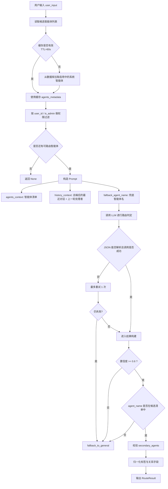
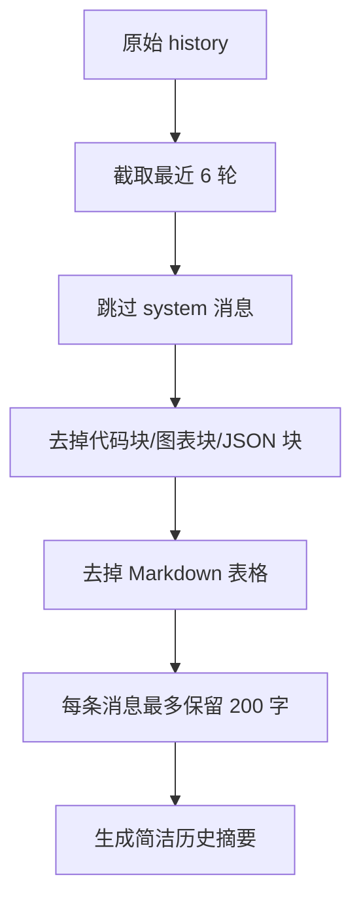
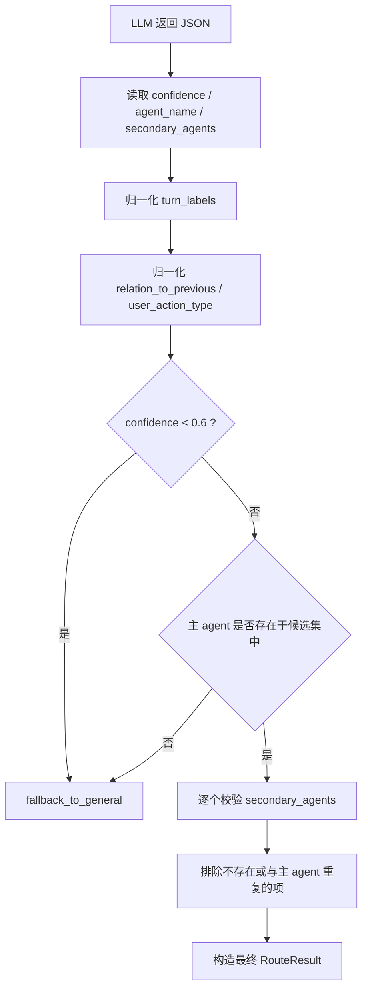
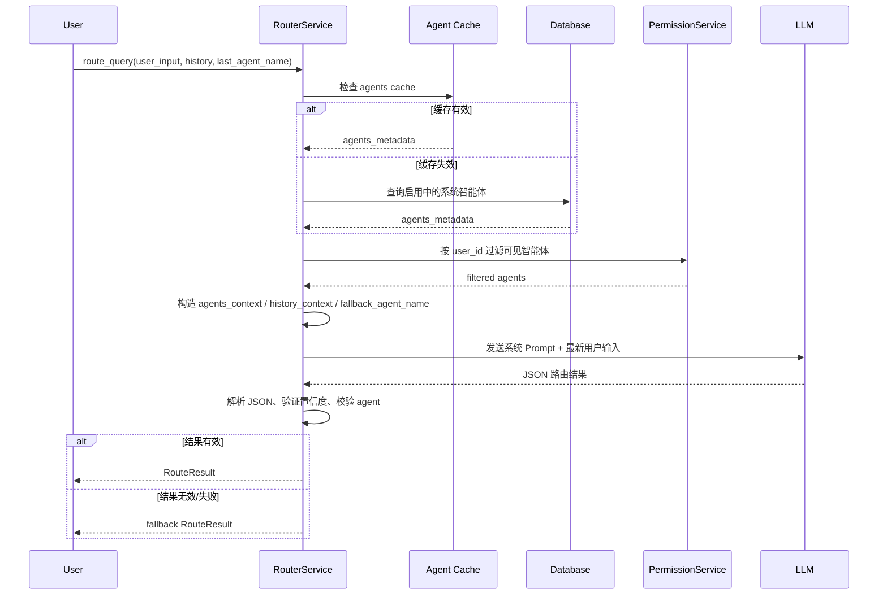

# Agent 意图路由识别核心逻辑详解

本文用于解释 [`router_service.py`](/Users/jacob/GitProject/yunshu-ai-agent-platform/app/services/ai/router_service.py) 中 Agent 意图路由识别的核心实现，重点面向教学、代码走读和系统设计说明。

## 1. 这个路由器到底解决什么问题

`RouterService` 的职责不是回答用户问题，而是在多个可用智能体之间做一次“分诊”：

- 用户这句话应该交给哪个主智能体处理
- 是否存在少量可并行的次级智能体
- 这轮输入和上一轮的关系是什么
- 这轮用户动作属于继续追问、上下文处理、系统管理还是普通闲聊

它本质上是一个“LLM 语义判断 + 工程化约束兜底”的混合路由器。

## 2. 整体架构概览

## 3. 核心入口：`route_query()`

`route_query()` 是整套路由逻辑的主入口，参数设计已经透露出它的路由策略：

- `user_input`：本轮用户最新输入
- `history`：历史对话，供指代消解与追问判断
- `enable_multi_agent`：是否允许多智能体协同
- `user_id` / `is_admin`：决定当前用户能看到哪些智能体
- `last_agent_name`：上一轮实际处理本会话的智能体，是“会话连续性”判断的关键

它的执行可以分成 6 步。

### 3.1 第一步：获取候选智能体，并做缓存

代码先检查：

- `self._agents_cache`
- `self._last_cache_time`
- `self._cache_ttl = 60`

含义很直接：60 秒内优先复用已拉取的智能体元数据，减少数据库读取次数。

如果缓存失效，则调用 `_fetch_agents_from_db()`，只取：

- `is_enabled == True`
- `is_system == True`

这意味着不是所有 Agent 都能进入路由池，只有“启用中的系统智能体”才有资格被分配请求。

### 3.2 第二步：按用户权限过滤智能体

拿到全量候选集后，还要经过 `_filter_agents_for_user()`：

- 管理员直接放行
- 未登录用户或没有 `user_id` 时默认不过滤
- 普通用户根据 `PermissionService(session).get_user_permissions()` 返回的 `agents` 权限集合筛选

这一层说明路由不是“语义上最像谁就给谁”，而是“在当前用户可用的智能体集合里选最像的那个”。

### 3.3 第三步：构造 Prompt，把路由规则显式教给 LLM

这份实现最重要的特点，是把核心路由准则硬编码在 `DEFAULT_SYSTEM_PROMPT` 中，而不是从数据库动态读取。

这样做的目的很明确：

- 避免运营侧误改 Prompt 导致路由行为漂移
- 让路由策略保持稳定、可审计、可复现

Prompt 由三块上下文拼接而成：

#### A. `agents_context`

通过 `_build_agents_context()` 生成，内容包含：

- `name`
- `display_name`
- `description`
- `capabilities`
- `UUID`

其中 `name` 是最终必须返回的标准标识，`display_name` 则是给 LLM 做中文语义匹配用的辅助信息。

#### B. `history_context`

通过 `_build_history_context()` 生成，内部又依赖 `_condense_history()` 和 `_strip_noise()`。

这里做了两件很关键的事：

1. 注入“上一轮由谁处理”
2. 对历史消息做去噪和截断，避免大段表格、图表、代码块淹没路由信号

#### C. `fallback_agent_name`

通过 `_resolve_fallback_agent_name()` 解析。兜底智能体优先级是：

1. `assistant`
2. `main`
3. `general-chat`

如果清单里存在这些名字中的任意一个，就把它写进 Prompt，明确告诉 LLM：不确定时应该退回谁。

## 4. Prompt 内部真正定义了什么路由策略

这份 Prompt 不是简单说一句“选最合适的智能体”，而是把路由拆成了明确的推理步骤。

### 4.1 Step 1：指代消解

Prompt 要求 LLM 先识别：

- “它”
- “这个”
- “那个”
- “刚才”
- “上面”
- “继续”
- “再查下”

这些表达经常没有完整主语，只有结合历史对话才能恢复真实意图。

这一步的本质是：先还原“用户到底在说谁/延续什么”，再去决定路由目标。

### 4.2 Step 2：会话连续性优先

这是整个路由器最重要的策略之一。

如果本轮是：

- 追问
- 补充
- 指代
- 省略主语的继续操作

并且没有明显切换到新领域，那么优先沿用 `last_agent_name` 对应的智能体。

这解决的是多轮对话里最常见的误路由问题。用户经常不会重复完整意图，而是直接说：

- “展开讲讲”
- “再画个柱状图”
- “那它去年呢”

没有上一轮智能体提示，这些句子非常容易被错误分发。

### 4.3 Step 3：语义匹配

只有在清楚不是简单追问时，才进入按智能体职责描述做匹配。

这里的关键约束是：

- 只能在“可用智能体清单”里选
- 判断依据必须来自 `name / 中文名 / description / capabilities`
- 禁止脑补系统里不存在的领域或虚构智能体

Prompt 还特别强调了一个容易混淆的边界：

- “当前机器 CPU/内存/端口/日志/服务状态”属于平台运行环境诊断，应走兜底/通用执行类智能体
- “机房、设备、业务报表、PUE、能耗、利用率趋势”才属于业务数据查询类智能体

也就是说，它不是按关键词机械匹配，而是按“语义对象属于当前运行环境，还是业务数据域”做区分。

### 4.4 Step 4：复合意图判定

`secondary_agents` 的使用非常保守。

只有同时满足以下条件，才允许填次级智能体：

- 用户问题明确跨越多个智能体职责
- 这些职责彼此不同
- 它们具备并行处理价值

否则宁可只给一个主智能体，也不轻易扩散任务。

### 4.5 Step 5：输出结构化标签

除了选主 Agent，Prompt 还要求 LLM 额外输出：

- `turn_labels`
- `relation_to_previous`
- `user_action_type`

这些字段不是最终业务结论，而是给后续 executor 的“通用语义提示”。

例如：

- `continuation_followup`：本轮是延续追问
- `context_action`：用户在操作上下文，比如导出、保存、发送
- `meta_action`：用户在管理 Agent、技能、会话
- `relation_to_previous = followup`：和上一轮是一脉相承的

## 5. 为什么历史上下文要先去噪再给 LLM

历史消息处理是这个路由器很工程化的一点。

### 5.1 `_condense_history()`

它只取最近 `max_rounds = 6` 轮历史，并且每条消息最多保留 `max_chars = 200` 个字符。

目的：

- 控制 Prompt 长度
- 避免旧上下文污染当前判断
- 强化“最近几轮更重要”的会话记忆

如果 `assistant` 消息里带有 `agent_name`，它会被格式化成：

- `Assistant[agent_name]: ...`

这让 LLM 能直观看到前面是谁在响应。

### 5.2 `_strip_noise()`

这个方法专门清除会干扰路由判断的大块内容：

- 代码块
- 图表块
- JSON 块
- Markdown 表格

处理后只保留自然语言主干。

可以把它理解为：路由器不关心答案展示得多漂亮，只关心“用户和系统最近在谈什么”。

## 6. LLM 调用阶段：不是一把梭，而是带重试的确定性判定

路由调用的实现有两个明显的工程决策。

### 6.1 `temperature=0.0`

`get_llm_async(temperature=0.0)` 表示这里追求的不是创造性，而是稳定性和可重复性。

对路由系统来说，同一句输入最好稳定打到同一类 Agent，而不是每次略有波动。

### 6.2 最多重试 1 次

代码里有：

- `for attempt in range(2)`

也就是总共尝试两次。

重试的原因是：

- 模型偶发返回非 JSON
- 模型暂时性调用异常
- 文本里带了额外解释导致解析失败

如果两次都失败，才真正回退到兜底 Agent。

这是一种“先尽量修复模型偶发不稳定，再做工程降级”的策略。

## 7. JSON 解析：对 LLM 输出做宽松接收

`_parse_router_json()` 体现了一个很实用的思想：不要假设模型永远完全守规矩。

它的处理顺序是：

1. 空内容直接返回 `None`
2. 如果外层包了 Markdown 代码块，先去掉三引号
3. 先尝试 `json.loads(content)`
4. 如果失败，再用正则从文本里提取第一个 `{...}` 结构继续解析

这说明系统虽然强制要求“纯 JSON”，但工程实现上仍然准备了容错层，避免因为模型多说了一句话就整次路由报废。

## 8. 结果构建：真正的安全阀在 `_build_route_result()`

LLM 即使成功返回了 JSON，也不代表结果会被直接信任。

`_build_route_result()` 负责做第二层校验和收口。

### 8.1 置信度阈值

如果：

- `confidence < 0.6`

则直接回退到兜底智能体。

这表示系统对“低把握度路由”采取的是保守策略：宁可交给通用助手，也不把请求错误分发给业务 Agent。

### 8.2 主智能体验证

LLM 返回的 `agent_name` 必须能通过 `_match_agent()` 在候选集中找到。

匹配顺序是：

1. 先按 `name` 精确匹配
2. 再按 `display_name` 做兜底匹配

但注意，最终 `RouteResult` 里存放的是数据库中的 `agent_id`，也就是系统内部真正稳定的主键，而不是模型输出的字符串。

### 8.3 次级智能体验证

`secondary_agents` 不是盲信的：

- 必须存在于候选集
- 不能和主智能体是同一个
- 只有 `enable_multi_agent=True` 时才会保留

所以多智能体协同是“经过白名单验证后的能力”，不是一句 Prompt 就完全放开的能力。

### 8.4 标签归一化

以下字段都会经过白名单归一化：

- `turn_labels`
- `relation_to_previous`
- `user_action_type`

如果模型输出了不存在的值：

- 标签会被丢弃
- 关系和动作类型会回退成 `unknown`

这可以避免下游执行器消费脏数据。

## 9. 兜底策略：失败时为什么能稳住

当出现以下情况时，系统会进入 `_fallback_to_general()`：

- 两次 LLM 调用都失败
- JSON 无法解析
- 置信度过低
- 返回了系统中不存在的智能体

兜底逻辑会从以下名字中按顺序寻找：

1. `assistant`
2. `main`
3. `general-chat`

一旦找到，就返回一个低置信度结果：

- `confidence = 0.1`
- `turn_labels = ["ambiguous"]`
- `relation_to_previous = "unknown"`
- `user_action_type = "unknown"`

这相当于明确告诉下游：

- 这次不是高质量精确路由
- 这是一次保护性降级
- 后续执行应偏通用、偏安全、偏保守

## 10. 关键数据流时序图

## 11. 这套实现最值得学习的设计点

### 11.1 用 LLM 做语义理解，用代码做边界控制

这不是纯规则系统，也不是纯模型系统。

- 模型负责理解复杂语义、上下文、追问、指代
- 代码负责权限过滤、缓存、候选约束、字段白名单、低置信度兜底

这是比较典型、也比较稳的生产化 Agent 路由设计。

### 11.2 “上一轮处理者”是多轮路由准确率的关键特征

很多路由系统只喂历史文本，但不显式告诉模型“上一轮到底是谁在处理”。

这份实现专门传入 `last_agent_name`，并在 Prompt 中强调“若是追问则优先沿用”，这是提高多轮稳定性的关键。

### 11.3 去噪比堆更多历史更重要

路由不是知识问答，历史越多不一定越好。

比起把几十轮完整消息全塞进去，这里更强调：

- 最近几轮
- 和意图有关的语言骨干
- 去掉图表、表格、代码等展示噪声

这是非常务实的 Prompt 工程思路。

### 11.4 兜底必须是“明确的一个 Agent”，而不是返回失败

对上层对话系统来说，“无法判断”通常不是好结果。

这份实现的设计倾向是：

- 尽量给出一个可执行的兜底 Agent
- 同时通过低置信度和 `ambiguous` 标签表达不确定性

这比直接返回异常更利于保持用户体验连续。

## 12. 一个典型例子：为什么它能识别“继续追问”

假设最近两轮会话如下：

- 上一轮由 `data-agent` 处理
- 用户刚问过“上海机房本月 PUE 趋势”
- 当前用户输入：“那再按周画个柱状图”

路由器的判断链条通常会是：

1. `_build_history_context()` 注入“上一轮由 `data-agent` 处理”
2. `_condense_history()` 保留最近相关消息
3. Prompt 的 Step 1/2 把“那再按周画个柱状图”识别成追问
4. LLM 输出 `agent_name = data-agent`
5. `_build_route_result()` 校验该 Agent 的确在当前候选集里
6. 返回主路由结果，并附带 `continuation_followup`、`same_topic`

换句话说，这套设计不是单看“柱状图”三个字，而是结合：

- 上一轮是谁处理
- 当前句子是否为延续动作
- 是否出现明显新领域切换

最终得出“继续交给原 Agent”。

## 13. 一句话总结

`RouterService` 的核心不是“让 LLM 猜谁最像”，而是：

先用权限和候选集限定范围，再用 Prompt 强化多轮连续性与语义匹配，然后用置信度、白名单、存在性校验和兜底 Agent 把结果收紧到可控范围内。

如果要用一句更工程化的话概括，它是一个：

**以 LLM 为语义引擎、以代码规则为安全护栏的多智能体意图分诊器。**
