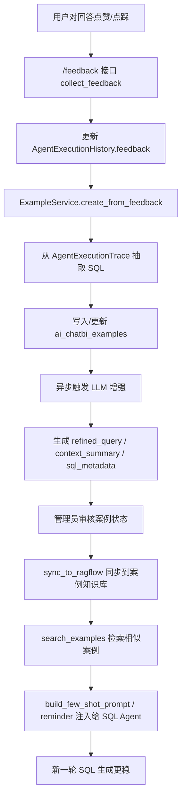
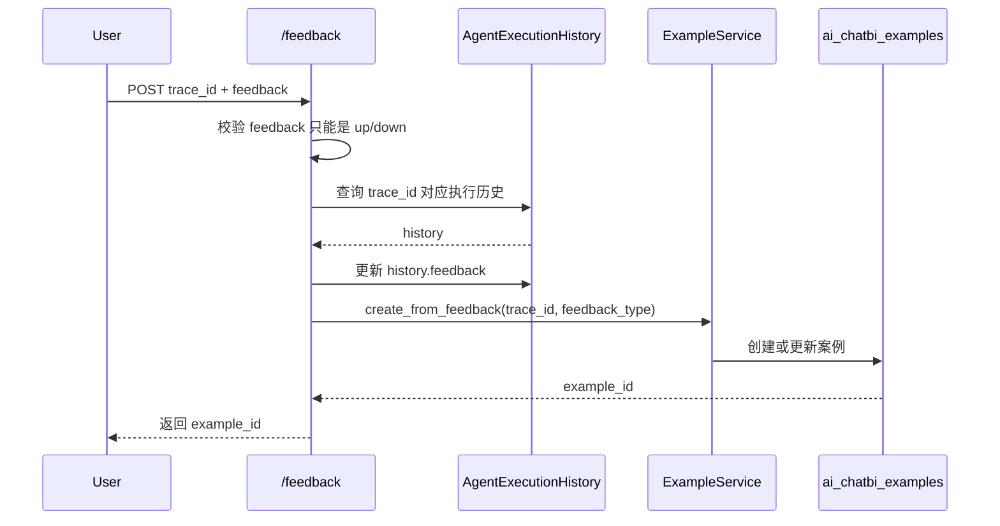
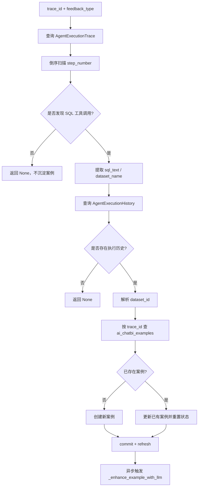
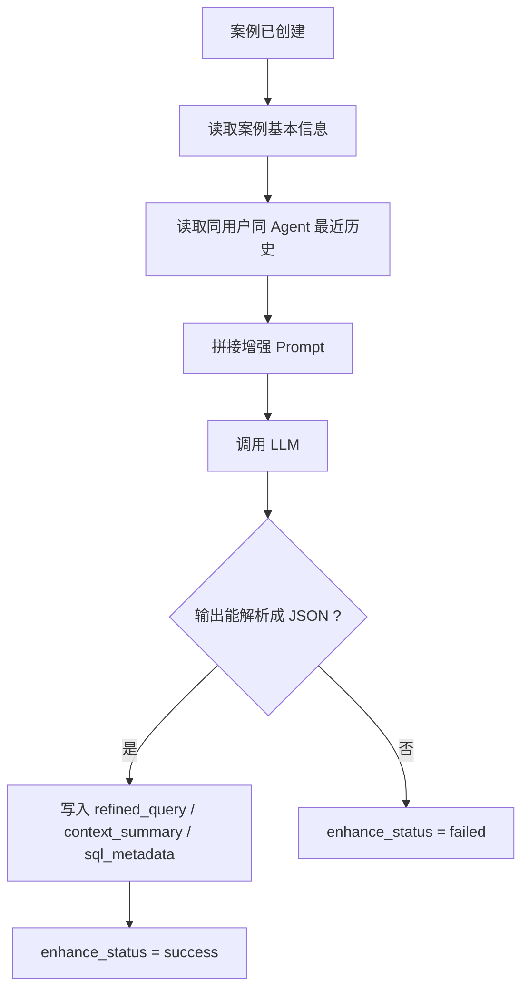
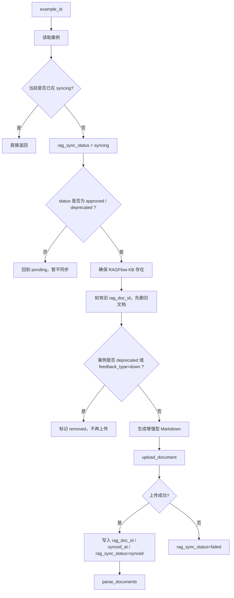
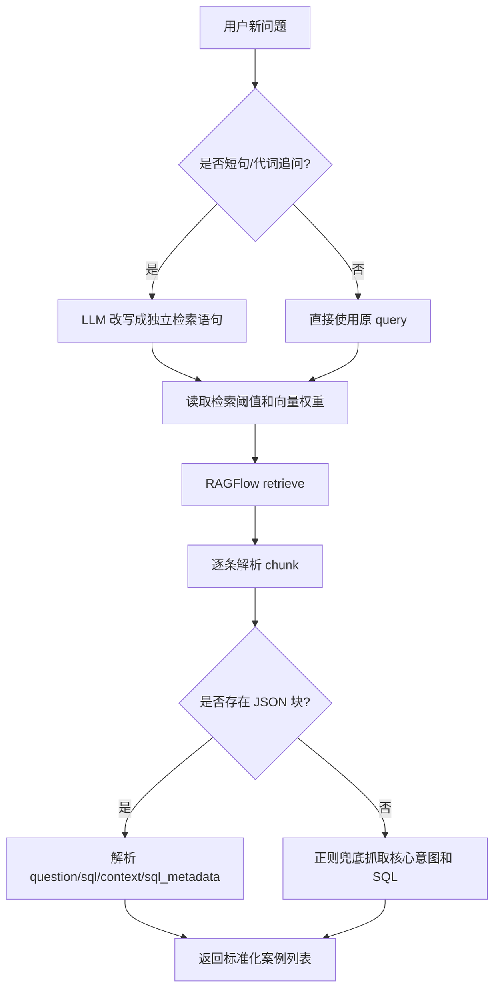
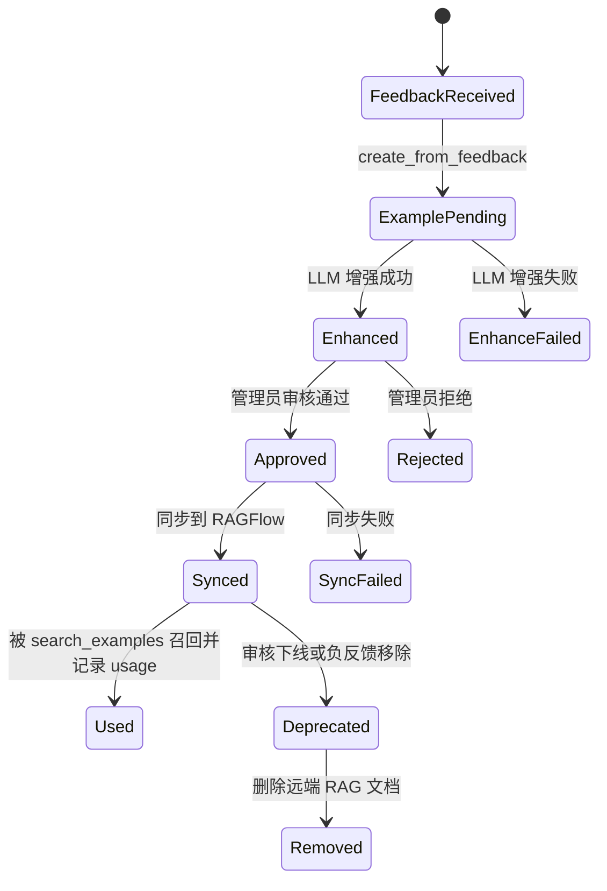

# BI 案例集核心逻辑详解

本文用于解释 [`chatbi_example_service.py`](/Users/jacob/GitProject/ai-agent-platform/app/services/chatbi_example_service.py) 和 [`chat_feedback.py`](/Users/jacob/GitProject/ai-agent-platform/app/api/portal/endpoints/chat_feedback.py) 中 BI 案例集的核心实现，重点面向教学、代码走读和系统设计说明。

这里的“BI 案例集”不是一份静态文档，而是一条完整的数据闭环：

- 用户先对一次 ChatBI 回答点赞/点踩
- 系统从执行轨迹里抽取当次成功 SQL
- 把这次问答沉淀成一个案例
- 用 LLM 对案例做意图补全和背景增强
- 审核通过后同步到 RAGFlow
- 后续新问题再从案例库里召回相似案例，拼成 few-shot prompt，反向提升 SQL 生成质量

可以把它理解成一个“从真实对话中自动积累 SQL 经验，再反哺模型生成”的案例学习系统。

## 1. 整体架构



## 2. 这个模块到底解决什么问题

只看代码表面，这像是“把点赞记录存下来”；但从整体设计看，它要解决的是 ChatBI 场景中的三个难题：

- 优质 SQL 如何从真实使用中持续积累，而不是完全靠人工整理
- 用户的碎片化追问，如何沉淀成可复用的“完整业务问题”
- 历史成功 SQL，如何在后续生成中被召回并真正影响模型选表、JOIN 和聚合逻辑

所以这套系统的核心不是“反馈统计”，而是“反馈驱动的案例学习”。

## 3. 数据模型：案例记录里保存了什么

从 [`chatbi_example.py`](/Users/jacob/GitProject/ai-agent-platform/app/models/chatbi_example.py) 可以看到，案例主表 `ai_chatbi_examples` 存的不是单一 SQL，而是一整份“可教学、可检索、可回放”的案例对象。

主要字段包括：

- `trace_id`：这次案例对应的执行链路
- `agent_id`：由哪个 Agent 生成
- `dataset_id`：关联的数据集
- `user_query`：用户原始问题
- `refined_query`：增强后、完整化后的问题
- `context_summary`：该 SQL 产生时的对话背景
- `sql_text`：最终成功 SQL
- `sql_metadata`：表名、查询类型、核心维度等结构化元数据
- `feedback_type`：来自用户的 `up/down`
- `status`：案例审核状态
- `enhance_status`：LLM 增强状态
- `rag_doc_id` / `rag_sync_status`：是否已同步到 RAGFlow
- `use_count`：后续被召回使用过多少次

这说明它不是简单把“问题 + SQL”存档，而是把“问题、上下文、SQL 逻辑、审核状态、知识库同步状态、使用情况”打包成一个完整生命周期对象。

## 4. 入口：`/feedback` 接口如何触发案例沉淀

BI 案例集的入口在 [`chat_feedback.py`](/Users/jacob/GitProject/ai-agent-platform/app/api/portal/endpoints/chat_feedback.py) 的 `collect_feedback()`。

它的流程很短，但位置非常关键：



### 4.1 它做了两件事

#### A. 更新执行历史反馈

接口先查 `AgentExecutionHistory.trace_id`，把 `feedback` 字段更新成：

- `up`
- `down`

这是“原始反馈记录”。

#### B. 触发案例沉淀

然后调用：

- `ExampleService.create_from_feedback(...)`

也就是说，反馈接口不只记录态度，还会尝试把这次执行变成一个可复用案例。

### 4.2 为什么这个设计有价值

因为它把“真实用户行为”变成了高质量样本来源。

相比人工手工维护 SQL 样例库，这种方式有三个优势：

- 样本来自真实业务问题
- SQL 已经在真实链路中执行成功
- 还有用户明确的正/负反馈信号

## 5. 核心沉淀逻辑：`create_from_feedback()`

这是 BI 案例集最关键的入口方法。

它做的事情可以概括成一句话：

**从一次真实执行链路里，抽出“成功 SQL + 问题 + 回答 + 数据集信息”，并幂等写入案例主表。**



### 5.1 第一步：从执行轨迹里抽 SQL

代码会查询 `AgentExecutionTrace`，并按 `step_number.desc()` 倒序扫描。

为什么倒序？

- 因为通常越靠后的步骤，越接近最终实际使用的 SQL
- 这样优先拿到最后一个成功候选，避免抽到中间调试态 SQL

筛选规则也很务实：

- `tool_name` 里包含 `sql`
- 或 `event_type == "tool"` 且 `tool_input` 中出现 `sql`

找到候选后，它会尝试三种方式提取 SQL：

1. `tool_input` 本身就是 `dict`
2. `tool_input` 是 JSON 字符串
3. 不是标准 JSON 时，用正则从字符串里抓 `SELECT ...`

这体现出它对执行轨迹数据格式不完全统一是有心理预期的，所以做了多层容错。

### 5.2 第二步：补齐执行历史信息

拿到 SQL 后，再去 `AgentExecutionHistory` 中查同一个 `trace_id`，补充：

- `agent_id`
- `query`
- `summary`
- `user_id`

这一步决定案例不只是“SQL 孤岛”，而是能带上：

- 用户原始问题
- AI 给出的回答摘要
- 谁生成的

### 5.3 第三步：解析数据集

如果前面抽到 `dataset_name`，就会用 `MetaDataset.name` 去查对应的 `dataset_id`。

这一步让后续案例检索和案例展示可以带上数据集语义，而不是只剩裸 SQL。

### 5.4 第四步：幂等创建或更新案例

案例表是按 `trace_id` 唯一约束的，所以这里不是无脑新增，而是：

- 没有则新建
- 已有则更新

更新时会做两件重要的事：

- 不管点赞还是点踩，都把 `status` 重置成 `pending`
- `rag_sync_status` 也重置成 `pending`

这说明设计者不想让反馈直接决定“案例上线”，而是要求重新进入审核链路。

### 5.5 第五步：异步触发 LLM 增强

落库后，它不会同步阻塞等待增强，而是：

- `asyncio.create_task(ExampleService._enhance_example_with_llm(example.id))`

这样做的好处是：

- 反馈接口响应更快
- 增强逻辑与主交易分离
- 即使增强失败，基础案例也已经落库

## 6. LLM 增强：把“真实问答”加工成“可教学案例”

`_enhance_example_with_llm()` 是这个模块最像“知识工程”的部分。

它的目标不是改 SQL，而是把原始案例加工得更适合检索和复用。

### 6.1 它补了哪些东西

方法最终让案例新增三类高价值信息：

- `refined_query`
- `context_summary`
- `sql_metadata`

#### `refined_query`

把碎片化问题改写成完整问题。

例如：

- “那去年的呢”

会被还原成类似：

- “查询 2025 年全年的销售额总额”

这一步对案例检索非常关键，因为未来召回时不能依赖原始对话上下文。

#### `context_summary`

把这次 SQL 生成前的业务背景压缩成短摘要，便于人理解，也便于后续提示词使用。

#### `sql_metadata`

把 SQL 的结构特征提炼出来，比如：

- `tables`
- `query_type`
- `dimensions`

这让后续 few-shot 注入时，不一定非要把整段 SQL 全塞进上下文，也能用结构化方式提醒模型。

### 6.2 为什么它要读取最近几轮历史

增强函数会查询同一 `agent_id + user_id` 最近 5 条历史，再转成简短对话背景。

目的很明确：

- 补齐原始问题里的指代和省略
- 帮模型理解这条 SQL 是在什么业务语境下产生的

如果只看 `user_query`，很多追问是残缺的；加上最近几轮历史，才能把案例去上下文化。

### 6.3 增强状态如何管理

增强前先把：

- `enhance_status = "pending"`

成功后改成：

- `enhance_status = "success"`

失败则改成：

- `enhance_status = "failed"`

这是一种典型的异步任务状态机，便于后台审计和重试。



## 7. 同步到 RAGFlow：让案例从“存档”变成“可召回知识”

仅仅把案例存在数据库里还不够，因为后续 SQL 生成需要的是“按语义快速召回相似案例”。

这正是 `sync_to_ragflow()` 负责的事情。

## 8. 先确保案例知识库存在：`ensure_chatbi_ample_kb_id()`

这个方法的职责是：

- 先从系统配置中拿知识库 ID
- 用 `list_documents()` 探测它是否仍然有效
- 如果失效，去 RAGFlow 按名字找同名库
- 如果连同名库都没有，就自动创建一个新的
- 最后把新的知识库 ID 回写到系统配置

这是一种“自动自愈”的配置策略。

也就是说，案例知识库不是手工预置的外部依赖，而是系统会尽量自己修复。

## 9. 同步逻辑：`sync_to_ragflow()`

这个方法做的是“把审核通过的案例转成一篇适合检索的 Markdown 文档，再上传到 RAGFlow”。



### 9.1 它为什么只同步 `approved` / `deprecated`

因为案例上线前要有人工审核。

当前逻辑里：

- `approved`：允许同步进知识库
- `deprecated`：允许同步删除动作
- 其他状态：先不进知识库

这意味着案例库不是简单“用户点了赞就进库”，而是“反馈触发沉淀，审核决定是否真正进入检索系统”。

### 9.2 为什么 `down` 反馈也会影响同步

即使案例曾经存在于库里，如果：

- `status == deprecated`
- 或 `feedback_type == "down"`

它也会被移出知识库，`rag_sync_status` 标成 `removed`。

这说明反馈不仅用于积累新案例，也会影响已有案例是否继续作为 few-shot 样本存在。

### 9.3 Markdown 模板为什么设计成“双层结构”

同步时生成的文档既有面向人阅读的自然语言层，也有面向系统解析的结构化层。

文档内容大致分成：

- 标题：案例名称
- 核心意图：`refined_query`
- 业务背景：`context_summary`
- 已验证 SQL：代码块
- 结构化 JSON：问题、原始问题、SQL、数据集名、trace_id、sql_metadata

这样的好处是：

- 人看得懂
- RAG 可以做语义检索
- 程序还能稳定从尾部 JSON 中重新解析出关键字段

## 10. 检索：`search_examples()` 如何把历史案例召回出来

这一步是案例真正反哺模型生成的核心。

`search_examples()` 不是简单关键字查库，而是一个“带去上下文化改写”的检索器。

### 10.1 先保证知识库存在

检索前会先调用 `ensure_chatbi_ample_kb_id()`，如果知识库不可用，直接跳过返回空列表。

这避免了检索阶段因为外部依赖异常而把整条 SQL 生成链路拖死。

### 10.2 必要时先改写用户查询

如果：

- `history` 存在
- 且 query 很短
- 或包含“那、它、这个、之前、刚才、统计结果”这类依赖上下文的词

就会调用 `_rewrite_query_for_search()`，用 LLM 把用户问题改写成独立完整的检索问题。

这一步很重要，因为案例库是跨会话知识库，不能指望它理解当前对话里的“那这个呢”。

### 10.3 从配置中心动态读取检索参数

检索时还会从 `ConfigService` 动态拿：

- 相似度阈值
- 向量相似度权重

这意味着案例检索强度是可以运营调优的，而不是写死在代码里。

### 10.4 解析检索结果时优先吃结构化 JSON

RAGFlow 返回的是 chunk 文本，代码解析顺序是：

1. 先找尾部 ```json``` 代码块
2. 解析出 `question`、`sql`、`context_summary`、`dataset_name`、`trace_id`、`sql_metadata`
3. 如果 JSON 解析失败，再用正则兜底去抓“核心意图”和 SQL 代码块

这体现了一个很稳的思路：

- 同步时写结构化文档
- 检索时优先按结构化文档回读
- 结构化失败后再退回半结构化正则



## 11. 去上下文化改写：`_rewrite_query_for_search()`

这个方法虽然不长，但价值很大。

它专门解决一个经典问题：

- 当前用户说的是“那去年的呢”
- 案例库里存的是“查询 2025 年全年销售额总额”

如果不先改写，语义检索召回质量会很差。

所以它会结合最近最多 6 条历史，要求 LLM：

- 补全代词
- 提取实体和指标
- 只输出改写后的句子

这一步本质上是在做案例检索前的“查询重写”。

## 12. Few-shot 注入：案例不是只检索出来看，而是要真正影响生成

检索出案例后，还要把它变成模型真正会参考的提示词。

这里有两个方法：

- `build_few_shot_prompt()`
- `build_few_shot_reminder()`

## 13. `build_few_shot_prompt()`：主提示块

这个方法会把检索到的案例拼成一段强约束说明，核心目标是：

- 不只是告诉模型“这里有历史案例”
- 而是明确规定哪些部分必须复用，哪些部分允许改动

### 13.1 它最重要的设计不是展示案例，而是定义边界

当最高相似度 `>= 0.65` 时，会进入“强制参考指令”模式，明确要求：

- **必须复用**：物理表名、JOIN 关系、核心聚合函数
- **允许适配**：WHERE 条件、时间范围、SELECT 别名
- **禁止改动**：除非 Schema 证明表不存在，否则不得替换核心表

这套边界是整个案例系统最关键的“防幻觉护栏”之一。

### 13.2 为什么要把相似度数字翻译成语义标签

代码把相似度分成：

- `【极高匹配】`
- `【较高匹配】`
- `【供参考】`

这不是给人看，而是给模型看。

相比让模型自己理解 `0.64` 和 `0.52` 的差别，这种语义标签更容易让它形成优先级。

### 13.3 为什么第一个案例会加星标

第一个案例通常是最高相似度命中，所以代码会给它加：

- `⭐`

本质上是在给模型做“注意力排序”，让它优先模仿最接近的那个 SQL 结构。

## 14. `build_few_shot_reminder()`：二次提醒块

这个方法存在的原因非常实用。

很多时候主 Agent 会先去查实时 Schema，查完之后模型注意力可能被“新鲜的字段信息”带偏，反而忘了刚刚检索出的历史案例。

所以这里又专门补了一个精简提醒块，在 Schema 返回后再次强调：

- 核心表
- 查询类型
- 核心维度
- SQL 前几行逻辑线索

它不重复整段 SQL，而是做“短提示再聚焦”。

这是一种典型的多阶段 Prompt 设计。

## 15. 使用记录：`record_usage()`

案例被召回后，系统还会记录它到底有没有被实际引用。

它做两件事：

- 主表 `use_count + 1`
- 在 `ai_chatbi_example_usages` 里插入明细流水

这样后续就能知道：

- 哪些案例常被召回
- 哪些案例虽然入库但几乎没人用
- 相似度高的案例是否真的频繁发挥作用

这为后续案例治理、排序和淘汰提供了基础数据。

## 16. 审核：`audit_example()`

审核方法负责改变案例 `status`，同时在必要时联动删除 RAGFlow 文档。

如果状态变成：

- `deprecated`
- `rejected`

并且案例已经有 `rag_doc_id`，它会尝试去远端知识库删掉对应文档，并把本地状态标成 `removed`。

这说明案例库是“可治理”的，不是只增不减。

## 17. 生命周期总览



## 18. 这套设计最值得学习的点

### 18.1 用用户反馈驱动样本积累

很多系统的 few-shot 样本是人工手工维护的，更新慢、覆盖窄。

这里则是：

- 用户行为触发沉淀
- 真实成功 SQL 自动入候选池
- 审核后进入知识库

这是把线上使用反过来变成训练资产。

### 18.2 “去上下文化”是案例可复用的关键

真实对话里的用户问题常常是碎片化的。

如果不做：

- `refined_query`
- `context_summary`

这些案例即使存下来，后续也很难被稳定召回和理解。

### 18.3 不只存 SQL，还存“为什么这条 SQL 合适”

`sql_metadata`、业务背景、查询类型、核心维度这些信息，让案例不只是“答案”，更像“可解释模板”。

### 18.4 检索和提示词注入是成套设计

很多项目只做了“案例入库”，但没有想清楚“入库后如何真正影响模型生成”。

这里从：

- RAG 检索
- query 重写
- 主 few-shot prompt
- Schema 后二次提醒

形成了一条完整链路，设计是连贯的。

## 19. 当前实现中的注意点

这部分不是在否定整体设计，而是帮助教学时区分“设计意图”和“当前代码细节”。

### 19.1 `create_from_feedback()` 形参与实参命名不一致

方法签名当前写的是：

- `feedback_tryp`

但函数内部和调用处都在使用：

- `feedback_type`

从实现上看，这里大概率会导致运行时报错或变量未定义，属于明显命名瑕疵。

### 19.2 知识库配置 key 有拼写不一致

代码里同时出现了：

- `chatbi_sample_knowlege_base`
- `chatbi_sample_knowledge_base`

这会导致“读取旧 key、回写新 key”的配置不一致风险。

### 19.3 方法名存在 `ample/sample` 不一致

当前定义的是：

- `ensure_chatbi_ample_kb_id()`

但别处又调用：

- `ensure_chatbi_sample_kb_id()`

这说明审核删除路径里大概率存在方法名调用错误。

### 19.4 某些异常处理里有变量名笔误

例如 `search_examples()` 里在改写失败时记录：

- `{ree}`

但异常变量实际是 `e`。

这类问题不会改变设计思路，但会影响运行稳定性。

### 19.5 `sync_to_ragflow()` 里有重复的 `except`

代码中已经有一次：

- `except Exception as e: ...`

后面又紧跟了一次同类型 `except`，从 Python 语义和可达性看，这段值得单独检查。

### 19.6 `chat_feedback.py` 里 `BackgroundTasks` 当前没有实际使用

接口签名接收了 `background_tasks`，但实际沉淀案例仍然是直接 `await ExampleService.create_from_feedback(...)`。

这意味着：

- 当前反馈接口并没有真正把沉淀动作丢到 FastAPI 后台任务
- 它依然要等待案例创建过程完成

## 20. 一句话总结

这套 BI 案例集的核心，不是“保存几条 SQL 样例”，而是：

**把用户反馈过的真实成功 SQL 沉淀成带上下文、带结构化元数据、可审核、可同步、可检索、可反向注入提示词的经验资产，再用这些经验资产持续约束后续 SQL 生成。**

如果用更工程化的话概括，它是一个：

**由反馈驱动、以案例为中介、通过 RAG 与 few-shot 反哺生成质量的 ChatBI 经验闭环系统。**
