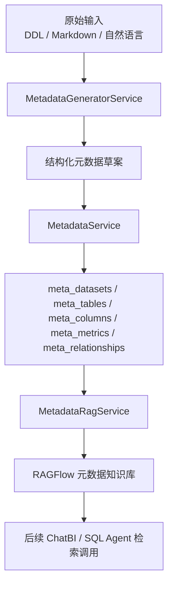
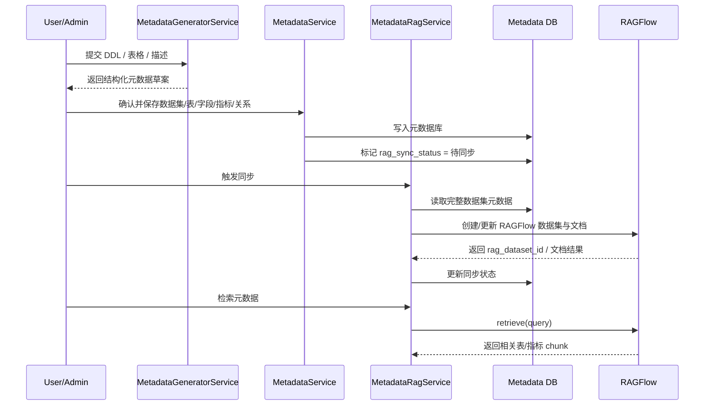
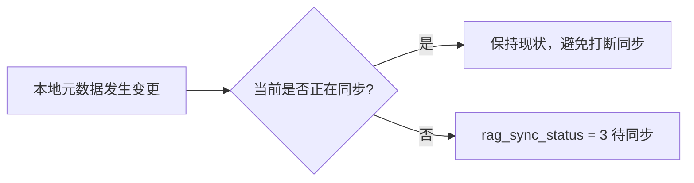
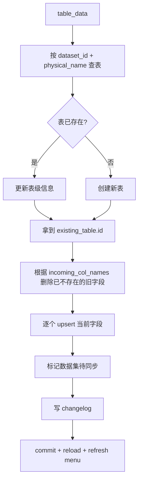
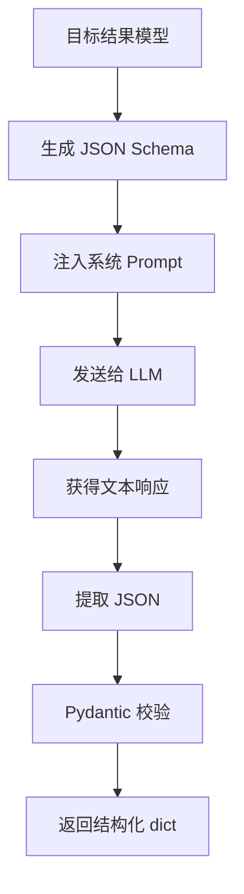
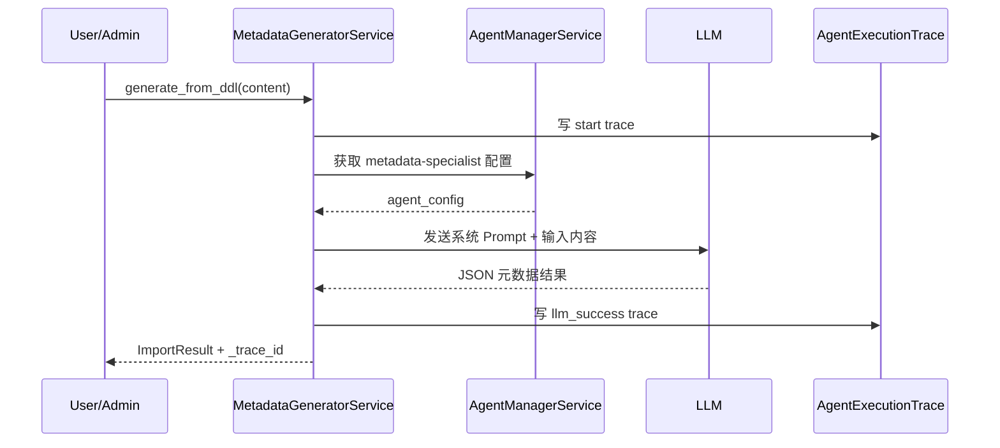
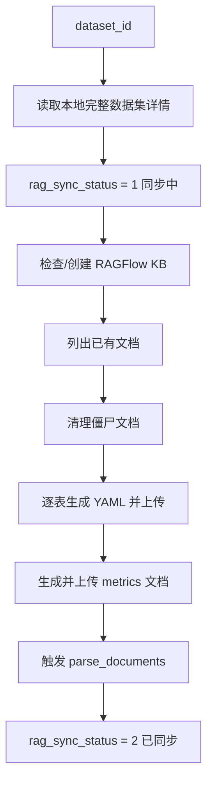
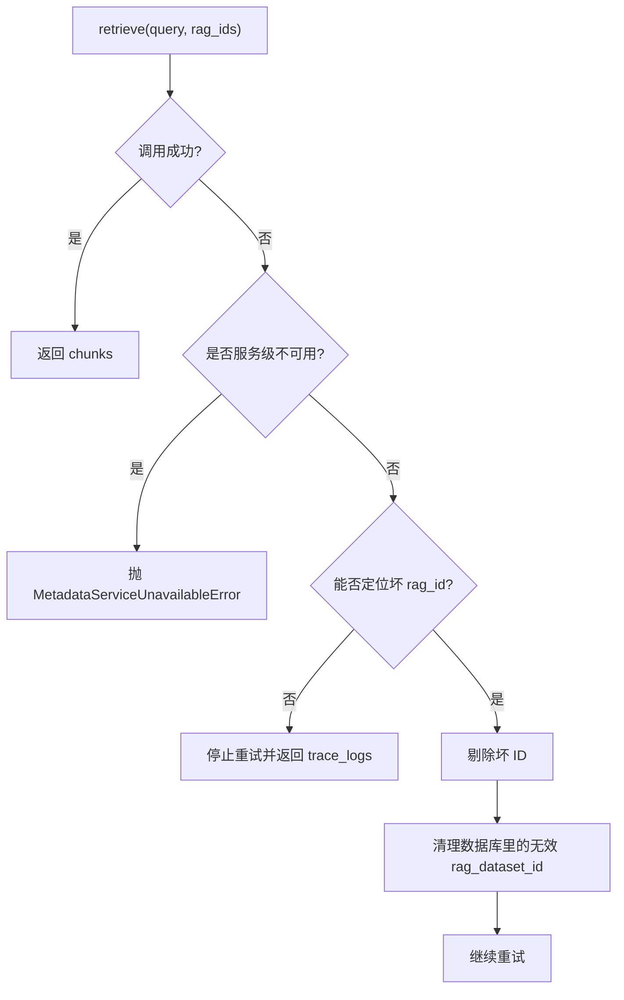

# ChatBI 元数据服务核心逻辑详解

本文用于解释 [`metadata_service.py`](/Users/jacob/GitProject/ai-agent-platform/app/services/metadata_service.py)、[`metadata_rag_service.py`](/Users/jacob/GitProject/ai-agent-platform/app/services/metadata_rag_service.py) 和 [`metadata_generator.py`](/Users/jacob/GitProject/ai-agent-platform/app/services/metadata_generator.py) 中 ChatBI 元数据相关服务的核心实现，重点面向教学、代码走读和系统设计说明。

这三份代码共同完成的是一条完整链路：

- 用 AI 从 DDL / Markdown / 自然语言里生成元数据草案
- 把数据集、表、字段、指标、关系保存到本地元数据库
- 把本地元数据同步成适合 RAG 检索的知识镜像
- 在后续 SQL 生成或知识查询时，把这些元数据重新召回给 Agent

它不是单一 CRUD 模块，而是一套“元数据生产 + 元数据治理 + 元数据检索”的基础设施。

## 1. 三个服务分别负责什么

先看职责边界：

- `MetadataGeneratorService`
  - 负责“生成”和“增强”
  - 用 LLM 把原始输入转成结构化元数据、推荐指标、补全数据集描述和标签

- `MetadataService`
  - 负责“存储”和“治理”
  - 管理数据集、表、字段、指标、关系的本地 CRUD、权限过滤、导出、变更日志

- `MetadataRagService`
  - 负责“镜像”和“检索”
  - 把本地元数据转换成 YAML 文档同步到 RAGFlow，并提供带重试的 RAG 检索能力

可以把它理解成三层架构：

## 2. 底层数据模型长什么样

从 [`app/models/metadata.py`](/Users/jacob/GitProject/ai-agent-platform/app/models/metadata.py) 可以看到，元数据系统的核心对象分成 5 类：

- `MetaDataset`
- `MetaTable`
- `MetaColumn`
- `MetaMetric`
- `MetaRelationship`

其中：

- `MetaDataset` 是顶层容器
- `MetaTable` 属于某个数据集
- `MetaColumn` 属于某张表
- `MetaMetric` 属于某个数据集
- `MetaRelationship` 用来描述表与表的 JOIN 关系

`MetaDataset` 上还带了 RAG 同步相关字段：

- `rag_dataset_id`
- `rag_synced_at`
- `rag_sync_status`
- `rag_sync_notes`

这说明“元数据本地库”和“RAG 知识镜像”是两个层次，本地库是源头，RAG 是派生副本。

## 3. 整体调用链路

如果把三份服务放在一起看，它们在系统中的典型工作顺序大概是这样：

## 4. `MetadataService`：本地元数据的主治理层

这份服务是整个系统的“事实来源管理器”。

它的职责不是做智能推理，而是保证本地元数据：

- 能被正确创建、更新、删除
- 能被权限控制
- 能导出成统一结构
- 能在修改后触发后续同步和菜单刷新

## 5. 数据集查询：`get_datasets()` 和 `get_dataset_by_id()`

### 5.1 `get_datasets()`

这个方法返回数据集列表，并预加载：

- `tables`
- `metrics`

然后给每个数据集补 3 个派生计数：

- `table_count`
- `metric_count`
- `relationship_count`

其中关系数量不是直接存在于 `MetaDataset` 表里的，而是通过该数据集下所有表的 ID 去反查 `MetaRelationship` 数量。

这说明这里的数据集列表不是纯 ORM 结果，而是已经被加工成更适合前端卡片展示的对象。

### 5.2 `get_dataset_by_id()`

这个方法的重点有两层：

1. 权限过滤
2. 细节补齐

权限过滤时，如果不是管理员且传入了 `user_id`，就会通过：

- `UserRoleRelation`
- `ResourcePermission`

检查当前用户是否对这个 `dataset_id` 拥有 `metadata` 资源权限。

拿到数据集后，它还会额外补：

- `tables.columns`
- `metrics`
- `relationships`
- 各类 count

其中 `relationships` 不是直接 ORM 反向关系，而是调用：

- `get_relationships_by_dataset()`

单独查出来的。

## 6. 搜索与权限：`search_datasets()`

这个方法体现了一个很实用的设计：

- 先按状态过滤
- 再按用户权限过滤
- 最后按关键字搜索

搜索范围是：

- `MetaDataset.name`
- `MetaDataset.display_name`

同时它还预加载了 `tables`，避免在后续遍历时出现 `DetachedInstanceError`。

这说明这份服务已经考虑到“查询结果对象会在会话外继续使用”的实际调用场景。

## 7. 为什么每次修改都要标记“待同步”

`_mark_dataset_as_modified()` 是整个服务里一个很关键但容易被忽略的方法。

它的逻辑是：

- 查询当前 `rag_sync_status`
- 只有当状态不是“同步中”时，才把它改成 `3`

从代码注释看，`3` 表示“待同步”或“已修改待同步”。

这意味着：

- 元数据本地库是主库
- RAGFlow 镜像不是实时强一致
- 每次元数据发生变化，都要把数据集打上“需要重新同步”的标记

这是一种典型的“源库 + 异步索引副本”设计。

## 8. 数据集 CRUD：不仅写库，还要写日志和刷新菜单

### 8.1 `create_dataset()`

创建数据集时，它做的不只是插入一条 `MetaDataset`：

- `flush()` 获取 ID
- 记录变更日志 `ChangelogService.log_change(...)`
- `commit()`
- `refresh()`
- 刷新 Agent 侧的数据集菜单 `AgentConfigProvider.refresh_dataset_menu()`

也就是说，元数据新增不仅影响数据库，还会影响 Agent 的可见数据集列表。

### 8.2 `update_dataset()`

更新数据集时，它会：

- 先读取旧数据
- 更新指定字段
- 标记为待同步
- 写 update 类型的 changelog
- 提交后返回最新对象

这里的关键思想是：元数据变更需要“可追溯”。

### 8.3 `delete_dataset()`

删除数据集时，除了删本地记录，还会：

- 读取旧数据用于 changelog
- 记住旧的 `rag_dataset_id`
- 提交后刷新 Agent 菜单
- 异步触发 `MetadataRagService.delete_rag_dataset(rag_kb_id)`

也就是说，删除本地数据集的同时，还会级联删除 RAGFlow 侧的镜像知识库。

## 9. 表和字段保存：`save_table_metadata()`

这是 `MetadataService` 里最能体现“元数据治理”味道的方法之一。

它处理的是“整张表及其字段列表”的 upsert。

核心流程如下：

### 9.1 它不是单字段更新，而是“整表对齐”

这个方法最重要的一点是：

- 传入的字段清单被视为当前真相

因此它会先删掉数据库里“存在但本次没有传入”的旧字段，再逐个更新或新增当前字段。

这说明它更像“用当前表结构覆盖数据库中的该表定义”，而不是只做局部 patch。

### 9.2 为什么这很重要

因为元数据经常来自外部导入或 AI 生成，如果不做“删除陈旧字段”的处理，本地表结构会越来越脏，RAG 检索也会越来越不可信。

## 10. 指标和关系 CRUD

指标和关系的 CRUD 逻辑与数据集/表类似，整体模式很一致：

- 先查原对象
- 执行 create / update / delete
- 写 changelog
- 标记 `rag_sync_status = 3`
- `commit()`

这体现出整个元数据治理层有一个统一约定：

- 任何影响“语义结构”的改动，都应该触发后续 RAG 重建

### 10.1 指标

指标 `MetaMetric` 保存的是：

- 名称
- 显示名
- 描述
- SQL 计算逻辑
- 单位

这让元数据系统不仅描述“表和字段”，还描述“业务口径”。

### 10.2 关系

关系 `MetaRelationship` 保存的是：

- 源表
- 目标表
- JOIN 条件
- JOIN 类型
- 描述

这对 ChatBI 特别关键，因为很多 SQL 幻觉问题不是“找不到字段”，而是“乱连表”。

## 11. YAML 导出：`export_dataset_yaml()`

这个方法的目标非常明确：

- 把一个完整数据集导出成适合 LLM/RAG 消费的 YAML 文本

输出内容包括：

- `dataset`
- `data_source`
- `description`
- `tables`
- `columns`
- `metrics`
- `relationships`

其中表里会保留：

- 物理名
- 业务术语 `term`
- 描述
- 同义词
- 列定义
- 枚举
- 主键标识

关系部分则会尽量把表 ID 还原成表物理名，提高可读性和 LLM 可用性。

这个导出能力本质上是在做：

- 把关系型元数据转换成提示词友好的文档结构

## 12. `MetadataGeneratorService`：AI 生成和增强层

这份服务的定位不是 CRUD，而是：

- 从非结构化输入里抽结构
- 从表结构里生成业务指标建议
- 从表摘要里生成数据集描述和标签

它是这套元数据系统里的“智能入口”。

## 13. 结构化契约：为什么全部先定义 Pydantic 模型

在 `metadata_generator.py` 顶部，先定义了几组结果模型：

- `ColumnMetadata`
- `TableMetadata`
- `MetricMetadata`
- `RelationshipMetadata`
- `ImportResult`
- `MetricRecommendationResult`
- `DatasetEnhanceResult`

这意味着 LLM 输出不是松散文本，而是要被约束到固定 schema 上。

然后 `_format_instructions()` 会把目标模型的 `model_json_schema()` 注入提示词，要求模型：

- 只返回 JSON
- 满足明确 schema

这个模式很值得教学，因为它本质上是在做“LLM 输出结构化编排”。

## 14. 通用 JSON 调用流水：`_invoke_json()`

`_invoke_json()` 是这份服务的核心基础方法。

它做 4 件事：

1. 把 `format_instructions` 注入系统 Prompt
2. 发送 `SystemMessage + HumanMessage`
3. 通过 `_extract_json()` 从模型文本中提取 JSON
4. 用目标 Pydantic 模型做二次校验

这意味着：

- 模型负责理解语义
- 代码负责兜底抽 JSON
- Pydantic 负责最终结构合法性

## 15. 追踪日志：`_save_trace_log()`

这份服务还专门把生成过程写进 `AgentExecutionTrace`。

记录内容包括：

- `trace_id`
- `step_number`
- `event_type`
- `agent_name = MetadataGenerator`
- `tool_name = LLM`
- `tool_output`
- 执行耗时
- 状态和错误信息

这说明元数据 AI 生成不是黑盒，它被纳入了统一审计链路，方便排错和回放。

## 16. 从 DDL 生成元数据：`generate_from_ddl()`

这是生成层最核心的方法。

它支持输入：

- DDL
- Markdown 表格
- 自然语言描述

然后用 LLM 产出：

- 表
- 字段
- 指标
- 关系

### 16.1 它的执行链路

### 16.2 为什么要读取 `metadata-specialist`

代码会通过：

- `AgentManagerService.get_active_agent_config(session, agent_name='metadata-specialist')`

读取一个专用智能体配置。

这说明元数据生成逻辑不是硬编码绑死某个模型，而是可以通过平台的 Agent 配置体系切换模型和系统提示词。

### 16.3 为什么还保留默认 Prompt

如果数据库里没有 `metadata-specialist` 配置，就退回默认 Prompt：

- 角色设定为“资深业务分析师和数据库建模专家”
- 要求抽业务术语和详细字段描述

这保证了系统即使没有额外配置，也能继续工作。

### 16.4 返回结果里为什么带 `_trace_id`

因为这类生成任务非常容易出现场景性问题：

- 模型输出格式错
- 某些表语义判断不准
- 某些字段推断异常

带上 `_trace_id` 后，调用方能直接回到执行审计表里排查全过程。

## 17. 推荐指标：`recommend_metrics()`

这个方法的目标不是解析表结构，而是根据已经存在的 schema 推荐值得沉淀的指标。

Prompt 明确要求模型推荐：

- KPI 聚合型指标
- 维度分布型指标
- 常用视图型指标

同时对 `calculation_logic` 提出约束：

- 必须是合法 ClickHouse SQL 表达式或完整 Query
- 分布/视图类必须写完整 `SELECT ... FROM ... [GROUP BY ...]`
- 禁止中文别名

这说明它不是“写几句描述”，而是希望直接生成可落地的指标定义。

## 18. 增强数据集：`enhance_dataset_metadata()`

这个方法做的是更高层的语义补全：

- 根据表信息生成数据集整体描述
- 自动打 3 到 5 个标签

这一步解决的是“数据集级别”的可理解性问题。

很多时候光有表结构不够，管理员还需要：

- 这个数据集用于什么业务
- 属于哪个领域
- 是生产、财务、监控，还是核心域

于是这里用 AI 给 `MetaDataset.description` 和 `tags` 提供建议。

## 19. `MetadataRagService`：元数据到 RAG 的镜像层

如果说 `MetadataService` 管的是“主数据”，那 `MetadataRagService` 管的就是“检索副本”。

它的职责主要有两类：

1. 把元数据同步到 RAGFlow
2. 从 RAGFlow 稳定地检索回来

## 20. 为什么要把元数据同步到 RAG

原因很简单：

- 本地关系库适合精确存储和管理
- 但 LLM 在问答时更适合通过语义检索拿到相关表/字段/关系片段

所以系统会把每张表、每组指标转成文本 chunk，同步到 RAGFlow，作为元数据语义索引。

## 21. 生成表文档：`generate_table_content()`

这个方法会把一张表转成一段 YAML，内容包括：

- `table_name`
- `table_desc`
- `dataset`
- `meta_name`
- `data_source`
- `description`
- `columns`
- `synonyms`
- `relationships`

其中关系不是全量塞入，而是只保留与当前表有关的那些关系，并标出：

- 对方表名
- 方向
- JOIN 类型
- JOIN 条件

这相当于把一张表压缩成“对 SQL Agent 最有用的一页说明书”。

## 22. 生成指标文档：`generate_metrics_content()`

指标被单独打成一个 `_metrics.txt` 文档，内容是：

- `metrics_scope`
- `metrics`

每个指标包含：

- 名称
- 显示名
- 描述
- 单位
- SQL 口径

这说明系统把“表结构知识”和“指标口径知识”分块建索引，而不是混在一篇大文档里。

## 23. 同步主流程：`sync_dataset()`

这是 RAG 镜像层的核心方法。

### 23.1 主流程概览

### 23.2 如何定位对应的 RAGFlow 知识库

每个数据集对应一个 RAGFlow dataset，命名规则是：

- `meta-{dataset.name}`

同步时会优先用本地保存的 `rag_dataset_id` 探测知识库是否还存在。

如果发现：

- `not found`
- `doesn't exist`
- `you don't own`

就会把本地保存的无效 ID 清空，再重新按名字查找或新建。

这说明同步层考虑到了“远端知识库被删了，但本地还记着旧 ID”这种常见脏状态。

### 23.3 为什么要清理 stale documents

同步时会先列出远端已有文档，然后计算“理论上应该存在的文件名集合”：

- 每张表对应一个 `{table}.txt`
- 如果有指标，再加一个 `_metrics.txt`

远端存在但本地不再需要的文档会被删掉。

这一步是在清理“僵尸文档”，避免 RAG 继续召回已经被删除的旧表结构。

### 23.4 为什么选择“删旧再传新”

对于每张表和 metrics 文件，它没有做原地 patch，而是：

- 如果旧文档存在，先删除
- 再上传新文档

这比增量修改更粗暴，但实现简单，而且能避免远端残留旧 chunk。

### 23.5 最后为什么要显式 `parse_documents`

上传只是把文件放进 RAGFlow，真正可检索还需要解析。

所以同步末尾会调用：

- `parse_documents(rag_kb_id, new_doc_ids)`

这一步把“文件”变成“可召回向量/文本块”。

## 24. 删除远端知识库：`delete_rag_dataset()`

这个方法很直接：

- 只要本地数据集被删
- 并且记得远端 `rag_kb_id`

就异步调用 RAGFlow 的：

- `delete_datasets([rag_kb_id])`

也就是说，元数据删除会尽量保持本地库和语义索引副本一致。

## 25. 检索重试：`retrieve_with_retry()`

这是 `MetadataRagService` 里最工程化的一段。

它的目标不是简单包一层 `client.retrieve()`，而是要处理两类不同故障：

1. 服务级不可用
2. 个别坏的 / 无权限的 rag dataset id

### 25.1 服务级不可用：立即终止

代码通过 `_SERVICE_UNAVAILABLE_HINTS` 检测：

- `502 / 503 / 504`
- `bad gateway`
- `timeout`
- `connection refused`
- `name or service not known`

如果命中，就抛：

- `MetadataServiceUnavailableError`

并明确要求上层：

- 不要重试
- 不要继续猜元数据
- 直接告诉用户服务暂时不可用

这是非常重要的安全设计，因为元数据不可用时让模型“猜表结构”风险极高。

### 25.2 个别坏 ID：剔除后重试

如果不是服务整体挂掉，而是某个 `rag_id` 无效、被删或无权限，逻辑会：

- 从错误消息里找出坏 ID
- 从 `rag_ids` 列表中移除它
- 调用 `_clear_invalid_rag_id()` 把数据库里对应的 `MetaDataset.rag_dataset_id` 清空
- 再用剩余 ID 重试

这是一种“边检索边自愈”的机制。

## 26. 同步状态更新：`_update_sync_status()`

这是一个很朴素但很重要的辅助方法。

它统一更新：

- `rag_sync_status`
- `rag_synced_at`
- `rag_dataset_id`
- `rag_sync_notes`

这样所有同步路径都能落到同一套状态语义上。

从当前代码和模型字段看，大致可以这样理解状态：

- `0`：未同步
- `1`：同步中
- `2`：已同步
- `3`：已修改待同步
- `-1`：失败

## 27. 这三层合在一起的真正价值

把三个服务合在一起看，它们解决的是 ChatBI 最基础但也最难的一件事：

- **让模型面对真实数据库时，不是裸奔，而是站在一套持续维护的业务语义层之上。**

具体来说：

- `MetadataGeneratorService` 让“建元数据”不再纯手工
- `MetadataService` 让“改元数据”可治理、可审计、可授权
- `MetadataRagService` 让“用元数据”变成面向 LLM 的语义检索能力

## 28. 当前实现中的注意点

下面这些点不影响我们理解整体设计，但如果用于教学，最好把“设计意图”和“当前实现细节”区分开讲。

### 28.1 `get_datasets()` 里保留了一段重复计算和 `pass`

前半段循环里先写了一版关系计数思路，但最后没有执行完成，后面又重新做了一轮真正的计数。

这说明当前代码里存在一段遗留的中间态逻辑，文档里可以把“后半段实际生效的逻辑”当作主线来讲。

### 28.2 `search_datasets()` 的参数设计有历史兼容痕迹

签名里同时出现了：

- `keyword`
- `query`

注释里也提到调用方历史上使用 `query`。

这说明这个接口有过参数名迁移，当前实现保留了一些兼容痕迹。

### 28.3 `export_dataset_yaml()` 里带有明显的现场思考式注释

关系导出部分能看出代码经历过“先假设 dataset.relationships 存在，再改成单独查关系”的调整。

这不影响功能，但说明这段代码更像“逐步修正后的结果”，不是一开始就完全收敛好的实现。

### 28.4 `sync_dataset()` 默认按“全量重建文档”而不是增量 patch

这在一致性上更稳，但如果未来表很多、同步频繁，成本会比细粒度增量更新高。

### 28.5 `retrieve_with_retry()` 很强调“不要让模型猜表结构”

这是一个很好的安全原则，教学时值得专门强调：

- 元数据服务不可用时，正确做法不是降级成自由发挥，而是明确失败

## 29. 一句话总结

这套 ChatBI 元数据服务的核心，不是“存几张表结构”，而是：

**把数据库结构、业务术语、字段描述、指标口径和表关系沉淀成一套可生成、可治理、可同步、可检索的语义层，再把这层语义能力稳定提供给后续的 SQL 生成和知识问答。**

如果用更工程化的话概括，它是一个：

**以本地元数据库为主源、以 LLM 生成增强为入口、以 RAGFlow 为语义索引副本的 ChatBI 元数据中台。**
