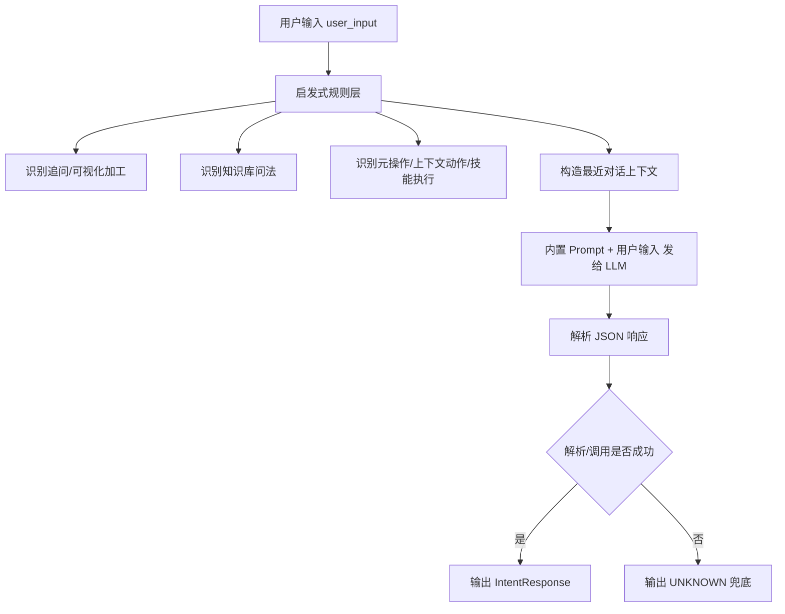
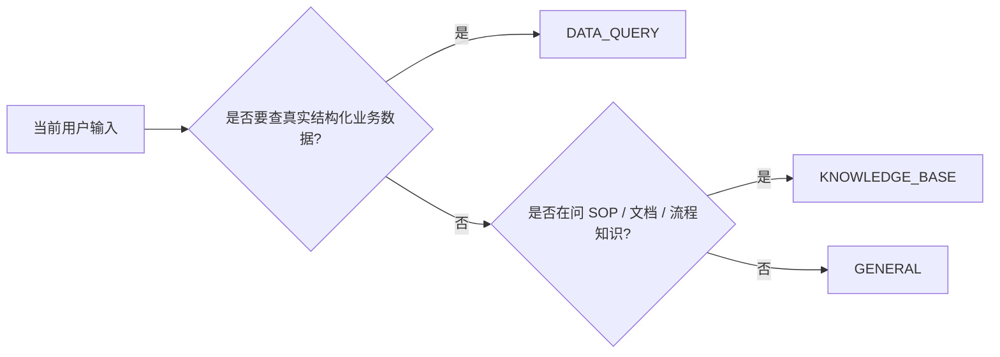
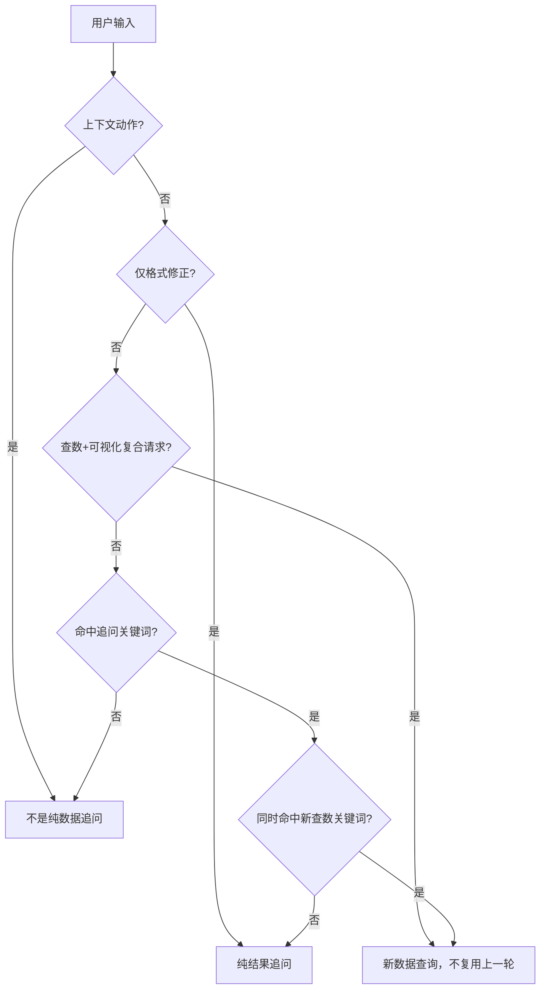
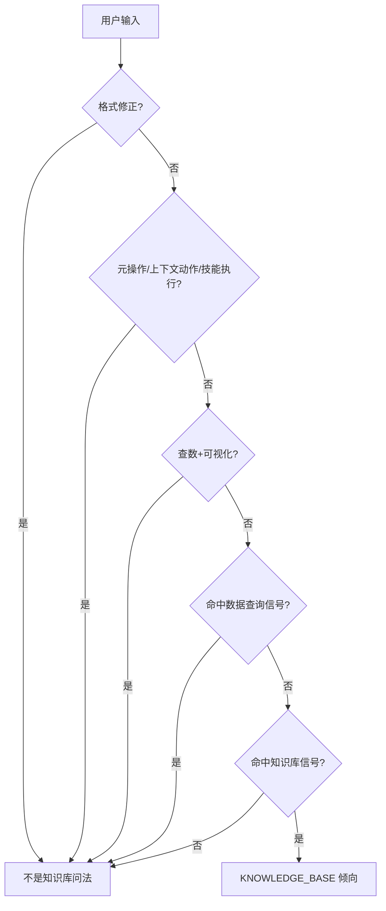
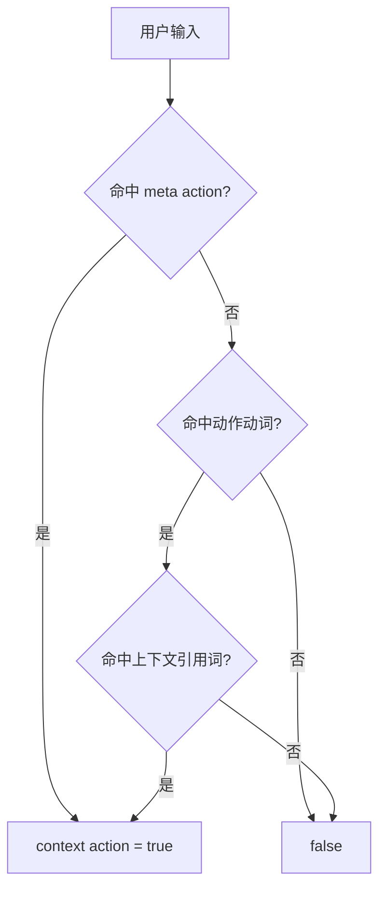
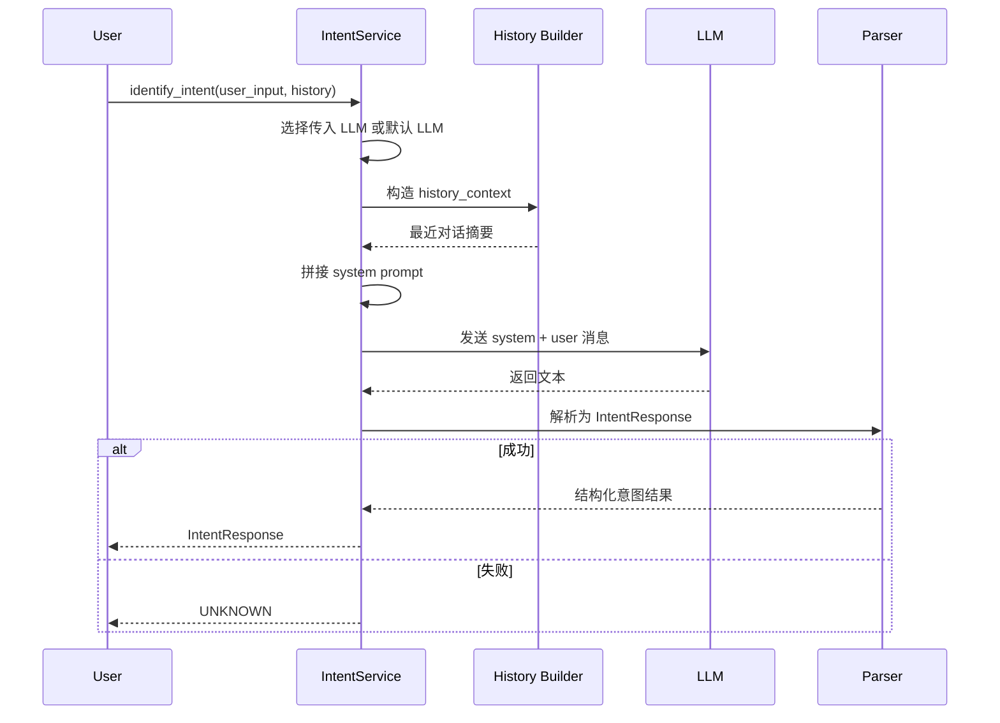

# 意图识别核心逻辑详解

本文用于解释 [`intent_service.py`](/Users/jacob/GitProject/ai-agent-platform/app/services/ai/intent_service.py) 中“意图识别”模块的核心设计，重点面向教学、代码走读和系统设计说明。

它解决的问题不是“回答用户”，而是先判断：

- 这句话是不是要查结构化业务数据
- 这句话是不是在问知识库/SOP
- 这句话是不是普通闲聊或系统管理动作

最终把用户输入收敛到统一的意图类型，给后续调度器和执行器使用。

## 1. 整体定位

这份实现本质上是一个“两层判定器”：

1. 轻量启发式规则
2. LLM 结构化分类

前者负责处理一些高频、低成本、容易被模式识别的场景，后者负责更复杂的自然语言语义判断。

## 2. 识别目标：三大主类 + 一个失败兜底类

代码里核心枚举是 `IntentType`，定义了四种结果：

- `DATA_QUERY`
- `KNOWLEDGE_BASE`
- `GENERAL`
- `UNKNOWN`

其中真正给 LLM 的强约束是前三类，`UNKNOWN` 主要是工程兜底。

### 2.1 `DATA_QUERY`

表示用户需要查询系统中的结构化业务数据，比如：

- PUE、温度、湿度、能耗、负载
- 告警记录、故障记录、操作日志
- 设备列表、资产明细、工单、容量记录
- 对上一轮数据继续做可视化、汇总、拆分、解读

### 2.2 `KNOWLEDGE_BASE`

表示用户在问非结构化知识，而不是当前真实业务数据，比如：

- SOP
- 操作手册
- 制度规范
- 处理流程
- 排查方法论

### 2.3 `GENERAL`

表示与业务数据查询无关，或者属于系统/对话本身的管理动作，比如：

- 打招呼
- 自我介绍
- 感谢、寒暄
- 把已有结果保存为技能、模板
- 基于现有上下文做封装或记忆

### 2.4 `UNKNOWN`

不是模型的正常业务分类，而是代码在以下情况下的兜底：

- LLM 初始化失败
- 模型调用失败
- 输出格式无法解析

## 3. Prompt 决定了这套分类器的语义边界

模块顶部的 `DEFAULT_SYSTEM_PROMPT` 非常重要，因为它把分类准则写死在代码中，而不是从数据库读取。

这样做的目的很明确：

- 避免运营配置误改
- 保持分类规则稳定
- 保证意图器在不同环境下行为可复现

Prompt 的核心判断可以概括成下面这张图：

但真正重要的，不只是三分类本身，而是 Prompt 里写入了几条偏业务安全的判断原则。

### 3.1 追问优先看上下文

如果用户说：

- “画个柱状图”
- “再按机房拆一下”
- “分析一下”
- “换成饼图”

这种句子单独看是不完整的，但如果最近一轮刚返回过数据，Prompt 会要求模型把它当作 `DATA_QUERY` 的延续追问。

### 3.2 流程知识和真实记录要分开

Prompt 明确区分：

- “故障处理流程是什么” -> `KNOWLEDGE_BASE`
- “最近有哪些故障记录” -> `DATA_QUERY`

也就是说，关键词“故障”本身不决定意图，决定意图的是用户到底在问“知识规则”还是“真实数据记录”。

### 3.3 模糊时偏向 `DATA_QUERY`

Prompt 明确写了一个很有工程取向的偏置：

- 业务相关但模糊时，倾向判成 `DATA_QUERY`

原因是把真实查数请求误判成闲聊，会丢失能力，还可能诱导模型编造答案；而把边缘问题判成查数，通常代价更小。

### 3.4 明确业务动词时不得归为 `GENERAL`

如果输入里出现：

- 查询
- 查看
- 统计
- 列出

这类强业务动作，Prompt 明确禁止模型把它们归成 `GENERAL`。

## 4. 启发式规则层：这不是纯 LLM 分类器

虽然核心方法 `identify_intent()` 最终会调用 LLM，但文件里先定义了不少轻量规则函数。这些函数本身很关键，因为它们承担了系统中其他模块的“快速短路判断”。

也就是说，这个文件不仅是意图识别器，也是整个调度系统的“共享判断词典”。

## 5. 第一类规则：识别“对已有数据结果的追问”

这一组函数围绕“上一轮已经有数据，这一轮只是继续加工”来设计。

相关函数有：

- `looks_like_result_formatting_followup()`
- `looks_like_compound_query_with_viz()`
- `looks_like_pure_result_followup()`
- `looks_like_data_followup()`

### 5.1 `looks_like_result_formatting_followup()`

它识别的是“只改展示格式，不重新查数”的请求，比如：

- 日期改成 `YYYY-MM-DD`
- 百分比格式显示
- 保留两位小数
- 重新排版、重新渲染

这类请求针对的是“已有结果的展示层”，不是新数据查询。

### 5.2 `looks_like_compound_query_with_viz()`

它识别的是“同一句里既要求查数，又要求可视化”的复合请求，比如：

- “查询最近一周 PUE 并画折线图”
- “统计各机房能耗并做柱状图”

这类请求不是单纯复用上一轮结果，而是一次新的数据查询。

判断逻辑是同时满足：

- 命中 `_COMPOUND_VIZ_KEYWORDS`
- 命中 `_COMPOUND_NEW_QUERY_KEYWORDS`

### 5.3 `looks_like_pure_result_followup()`

这是“纯数据追问”的核心判断函数。

它的逻辑顺序很值得学习：

1. 空输入直接否
2. 如果是上下文动作，则否
3. 如果是结果格式修正，则直接是
4. 如果是“查数 + 可视化”复合请求，则否
5. 必须命中追问关键词
6. 不能同时命中新查数关键词

换句话说，它在判断：

- 这句话是否明显依赖上一轮结果
- 而且不包含新的查库意图

### 5.4 `looks_like_data_followup()`

这个函数本身只是对 `looks_like_pure_result_followup()` 的语义包装。

它的价值不在复杂逻辑，而在于给调度器提供统一的、可读性更高的接口名。

## 6. 第二类规则：识别知识库问题

`looks_like_knowledge_query()` 的目标，是把 SOP/制度/说明类问题从“真实数据查询”里分离出来。

它的判断思路不是简单地“命中一个知识词就算”，而是先做排除，再做确认。

逻辑大致是：

1. 输入为空直接否
2. 如果是格式修正请求，否
3. 如果是元操作、上下文动作、技能执行，否
4. 如果是“查数 + 可视化”复合请求，否
5. 如果命中了强数据查询信号，否
6. 最后只在命中 `_KNOWLEDGE_SIGNALS` 时判真

这说明设计者非常担心把真实查数误判成知识问答，所以知识库识别采用了“保守放行”的方式。

## 7. 第三类规则：识别元操作、技能执行和上下文动作

这部分是整个文件里最容易被忽视、但其实很工程化的设计。

### 7.1 `looks_like_meta_action()`

它识别的是：

- 创建技能
- 保存为技能
- 固化为技能
- 把结果沉淀成 skill

这类动作不是重新查询业务数据，而是“对已有结果做管理封装”。

### 7.2 `looks_like_skill_execution()`

它识别的是：

- 使用某个技能
- 执行某个技能
- 运行某个技能
- 按某个技能处理

这和 `looks_like_meta_action()` 的区别很重要：

- `meta_action` 是“创建/保存技能”
- `skill_execution` 是“调用已有技能”

### 7.3 `looks_like_context_action()`

这是更宽泛的一层判断，识别的是：

- 保存
- 导出
- 下载
- 发送
- 分享
- 记住
- 固化

但它不是只看动词，还要求同时出现“已有上下文引用词”，比如：

- 这个
- 这些
- 上面
- 刚才
- previous

这样做是为了避免把“保存最近一个月订单”这种仍然需要查数的请求误判成“对已有结果执行动作”。

这个判定非常实用，因为它要求同时满足：

- 有动作
- 有对已有上下文的指代

## 8. 历史上下文：为什么要把最近对话压缩进 Prompt

`_build_history_context()` 的职责，是给 LLM 提供最近对话线索，尤其帮助识别“省略主语的追问”。

它的策略比较克制：

- 只保留 `user` 和 `assistant`
- 只取最近 6 条
- 每条最多保留 200 个字符
- 去掉 HTML 标签
- 压缩多余空白

这种设计说明它的目标不是保留完整对话，而是提炼出足以做上下文判断的最小语义骨架。

## 9. 结构化输出模型：`IntentResponse`

最终意图识别结果会被规范成 `IntentResponse`，包含：

- `intent`
- `confidence`
- `reasoning`
- `entities`

这几个字段分别解决不同问题：

- `intent`：分类结果是什么
- `confidence`：有多大把握
- `reasoning`：为什么这么判
- `entities`：从输入里提取了哪些关键对象

这说明它不是只返回一个类别标签，而是顺带给下游执行器和日志系统提供“可解释信号”。

## 10. 真正的入口：`identify_intent()`

`IntentService.identify_intent()` 是整套流程的主入口。

它的执行链路可以拆成 6 步。

### 10.1 第一步：确定使用哪个 LLM

逻辑是：

- 如果调用方显式传入 `llm`，优先使用它
- 否则懒加载默认模型
- 默认模型会缓存到 `self._llm`

这是一种常见的服务对象模式：

- 支持外部注入测试模型或特殊模型
- 生产环境默认只初始化一次

### 10.2 第二步：检查 LLM 是否可用

如果最后拿不到模型实例，就直接返回：

- `intent = UNKNOWN`
- `confidence = 0.0`

这是一层基础设施故障兜底。

### 10.3 第三步：构造系统提示词

这里会把两个占位块注入 `DEFAULT_SYSTEM_PROMPT`：

- `{history_context}`
- `{format_instructions}`

其中：

- `history_context` 来自 `_build_history_context(history)`
- `format_instructions` 来自 `_format_instructions()`

这样做的目的是让模型同时知道：

- 最近对话里有没有追问关系
- 输出必须是固定 JSON 结构

### 10.4 第四步：构造消息

消息一共两条：

- `system`：完整的分类规则和输出格式
- `user`：当前这轮原始输入

这说明整个意图识别过程是“单轮判断 + 历史压缩辅助”，不是把完整对话作为多轮聊天来跑。

### 10.5 第五步：调用模型

代码通过：

- `chat_client_from_handle(active_llm)`
- `generate_text(messages)`

拿到模型输出文本，再交给 `_parse_response()` 做结构化解析。

### 10.6 第六步：解析失败或调用失败则兜底

如果抛异常，会返回：

- `intent = UNKNOWN`
- `confidence = 0.0`
- `reasoning = 错误原因`

所以这套服务的工程哲学是：

- 正常路径走严格 JSON
- 异常路径也必须给出结构化对象

## 11. 响应解析：为什么 `_parse_response()` 要做两层尝试

`_parse_response()` 的策略很实用：

1. 先直接把整段文本当成 JSON 解析
2. 如果失败，再用正则提取第一个 `{...}` 块继续解析

这说明开发者虽然要求模型“必须只返回 JSON”，但仍然考虑到了模型偶尔会多说一句解释、加前后缀文本的现实情况。

这种“先严格、再容错”的解析方式，能明显提升稳定性。

## 12. 设计亮点：这份实现为什么值得学

### 12.1 不是把所有判断都扔给 LLM

文件里那些 `looks_like_*` 函数说明，系统并不想让每个细粒度判断都依赖模型。

原因通常有三个：

- 更快
- 更便宜
- 更可控

### 12.2 把“追问”当成一类特殊问题认真处理

多轮问答里最容易出错的不是首问，而是：

- “再画一下”
- “按周拆开”
- “改成表格”

这类输入单看语义很弱，但业务上非常关键，所以这份实现对追问和上下文动作投入了不少规则设计。

### 12.3 对误判风险有明确偏置

Prompt 里明确提出：

- 模糊业务问题时偏向 `DATA_QUERY`

这不是语言学上的“最中立”，而是产品和系统层面的“最安全”。

### 12.4 工程兜底比语义优雅更重要

不管是：

- LLM 不可用
- 模型输出不规范
- 解析失败

最终都不会返回裸异常，而是会产出结构化 `UNKNOWN`。

这对于上层调度器非常重要，因为它可以继续统一处理。

## 13. 当前实现中的一个注意点

这份代码从“设计意图”上是清晰的，但当前实现里有一个值得在教学文档里明确指出的点：

### `_format_instructions()` 目前的定义看起来存在实现瑕疵

当前代码写法是：

- 使用了 `@staticmethod`
- 函数签名却保留了 `self` 参数
- 返回值使用了 `{ ... }`，这在 Python 里会构造成 `set`，而不是 `str`

而调用点是：

- `format_instructions = self._format_instructions()`

从 Python 语义上看，这里有较大概率触发调用或类型问题。也就是说：

- 从设计上，它想注入“输出格式说明”
- 但从当前实现上，这个方法本身值得额外检查

这不影响我们理解它的“核心意图识别思路”，但如果后续要把这份文档用于代码教学，建议把这里当成一个实现注意点一起讲。

## 14. 一句话总结

`intent_service.py` 的核心不是单纯让 LLM 给一句话贴标签，而是：

先用启发式规则识别追问、知识库信号、上下文动作和技能操作，再结合最近对话把用户输入交给一个内置 Prompt 的三分类器，最后把结果约束成统一的 `IntentResponse`，并在失败时稳定退回 `UNKNOWN`。

如果用更工程化的话概括，它是一个：

**以 LLM 为主判定器、以启发式规则为辅助护栏、以结构化 JSON 为输出契约的意图分类服务。**
