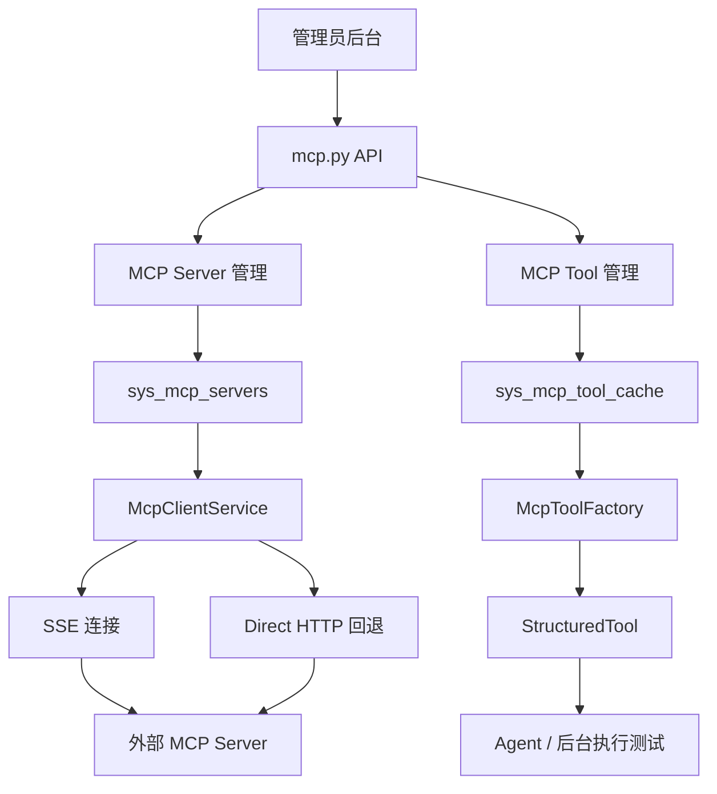
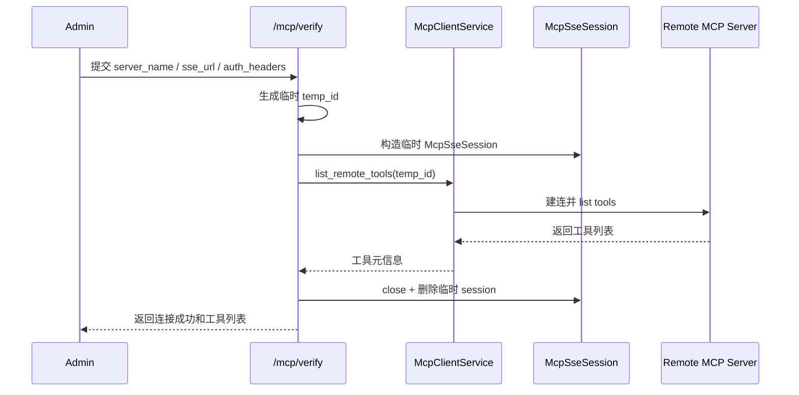
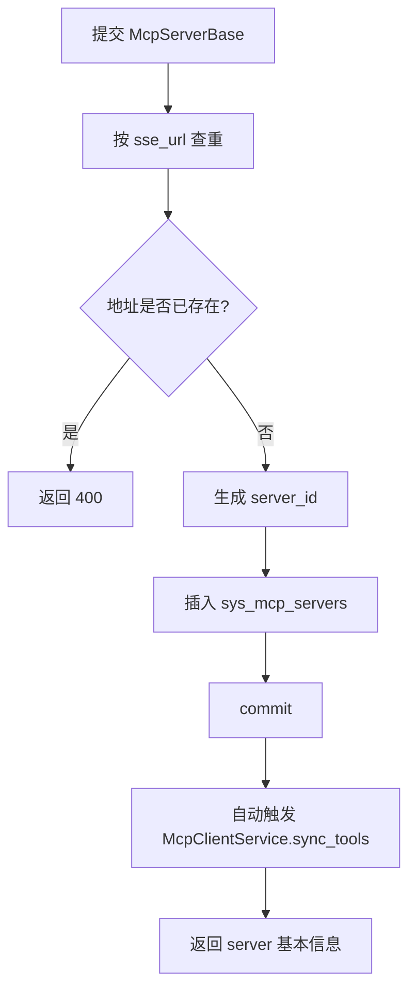
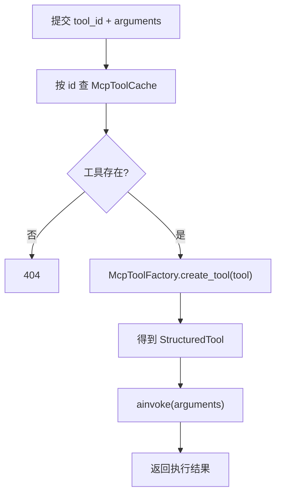
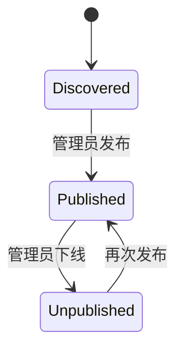
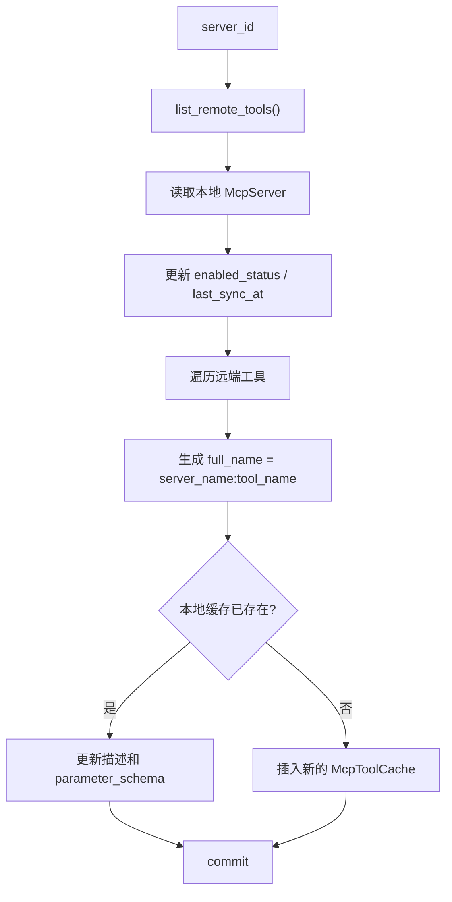
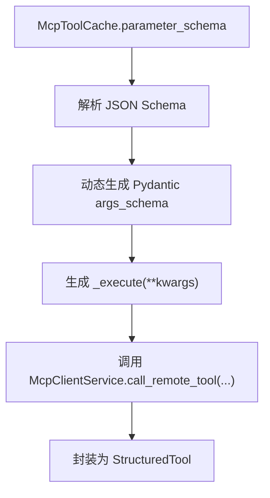
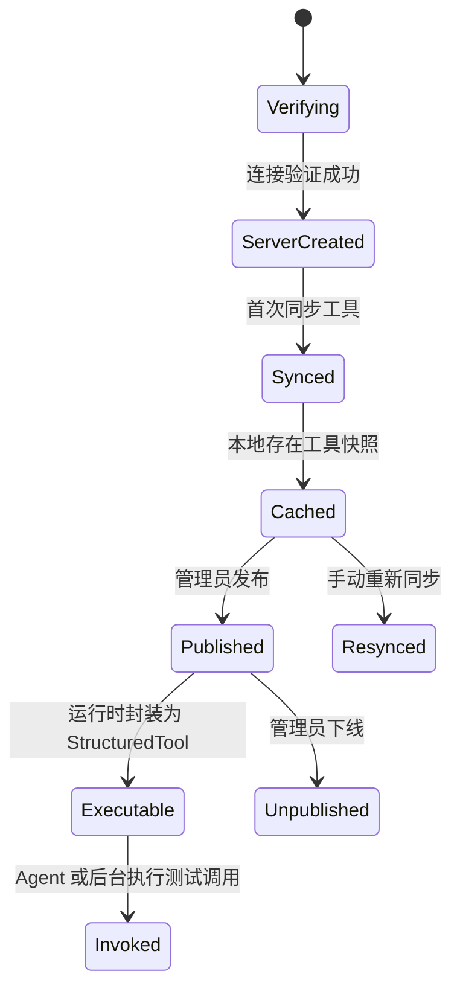

# MCP 相关服务核心逻辑详解

本文用于解释 [`mcp.py`](/Users/jacob/GitProject/ai-agent-platform/app/api/portal/endpoints/mcp.py) 为核心的 MCP 相关服务实现，重点面向教学、代码走读和系统设计说明。

为了把整条链路讲完整，本文也会补充几个直接相关的文件：

- [`mcp.py`](/Users/jacob/GitProject/ai-agent-platform/app/models/mcp.py)
- [`mcp_client.py`](/Users/jacob/GitProject/ai-agent-platform/app/services/ai/tools/mcp_client.py)
- [`mcp_factory.py`](/Users/jacob/GitProject/ai-agent-platform/app/services/ai/tools/mcp_factory.py)
- [`agent.py`](/Users/jacob/GitProject/ai-agent-platform/app/models/agent.py)

这套实现本质上是在做一件事：

- 把外部 MCP Server 暴露的工具能力
- 接入到平台本地
- 缓存成可治理的工具资产
- 再封装成 Agent 可调用的运行时工具

所以这里的核心不是“连一下远端接口”，而是一套完整的：

- MCP 服务接入
- 工具发现与缓存
- 发布控制
- 运行时调用桥接

## 1. 这个模块解决什么问题

如果平台想使用外部 MCP 工具，会遇到几个典型问题：

- 怎么保存 MCP Server 的连接信息
- 怎么验证一个远端服务是否真的能连通
- 怎么把远端工具列表同步到本地
- 怎么避免远端刚暴露的新工具立刻进入平台生产环境
- 怎么让 Agent 在运行时像调本地工具一样调用远端 MCP 工具

`mcp.py + mcp_client.py + mcp_factory.py` 这套代码，解决的正是这整条链路。

## 2. 整体架构

这张图最关键的是：

- `mcp.py` 负责后台入口与治理动作
- `McpClientService` 负责连接远端 MCP 服务
- `McpToolFactory` 负责把缓存工具转成平台运行时工具

## 3. 数据模型：MCP 在本地存什么

[`app/models/mcp.py`](/Users/jacob/GitProject/ai-agent-platform/app/models/mcp.py) 里定义了两张核心表：

- `McpServer`
- `McpToolCache`

## 4. `McpServer`：外部服务源

`McpServer` 存储的是 MCP 服务接入点本身，包括：

- `server_name`
- `sse_url`
- `auth_headers`
- `enabled_status`
- `last_sync_at`

它代表的是：

- 平台知道有哪些 MCP Server
- 每个 Server 用什么地址和认证方式连接

这里的 `auth_headers` 是 JSON 字符串，说明平台允许为不同 MCP Server 配置不同认证头。

## 5. `McpToolCache`：远端工具的本地快照

`McpToolCache` 存储的是从远端拉回来的工具清单快照，包括：

- `server_id`
- `tool_name`
- `tool_description`
- `parameter_schema`
- `is_published`

这张表的业务意义非常重要：

- 平台不会每次都实时读取远端工具列表来展示
- 而是先同步到本地缓存，再由管理员决定是否发布

这是一种“发现层”和“开放层”分离的设计。

## 6. `mcp.py` 这份文件到底在做什么

[`mcp.py`](/Users/jacob/GitProject/ai-agent-platform/app/api/portal/endpoints/mcp.py) 是 MCP 后台管理入口。

它主要提供 8 类能力：

1. 验证一个 MCP Server 是否可连通
2. 列出所有已登记的 MCP Server
3. 创建 MCP Server
4. 更新 MCP Server
5. 删除 MCP Server
6. 同步某个 MCP Server 的工具
7. 查看某个 MCP Server 下的工具及使用情况
8. 执行工具测试与发布开关

所以它更像“平台的 MCP 管理后台 API”。

## 7. 验证连接：`POST /verify`

这是 MCP 接入流程的第一步。

管理员录入一个 `server_name + sse_url + auth_headers` 后，不一定立刻入库，而是先做验证。

### 7.1 它的逻辑链路

### 7.2 为什么这里使用“临时 Session”

因为验证阶段还没有正式创建 `McpServer` 记录。

所以代码用：

- `temp_id = verify_xxx`

构造一个临时会话，先试连远端，验证成功后立刻销毁。

这是一种典型的“先探针验证，再落正式配置”的做法。

### 7.3 为什么返回的是工具列表而不只是成功/失败

因为管理员通常不只关心“能不能连”，还关心：

- 这个 MCP Server 暴露了哪些工具
- 暴露出来的工具是不是符合预期

所以验证接口返回的是一个小型发现结果，而不是单纯布尔值。

## 8. 列出服务器：`GET /servers`

这个接口负责展示平台当前登记的所有 MCP Server。

但它返回的不只是原始 `McpServer` 字段，还额外补了两个统计：

- `tool_count`
- `published_tool_count`

也就是说，后台列表页不仅知道“有哪些服务”，还知道：

- 每个服务同步到了多少工具
- 其中多少个已经正式发布

这体现的是治理视角，而不是纯连接配置视角。

## 9. 创建服务：`POST /servers`

创建 MCP Server 的逻辑并不是“只写一条配置到库里”。

它的完整意图是：

- 先登记服务源
- 再立即尝试同步工具

### 9.1 处理流程

### 9.2 为什么按 `sse_url` 查重

因为对 MCP Server 来说，地址本身就是服务源唯一性的核心标识。

如果两个配置项指向同一个地址，会导致：

- 工具缓存重复
- 管理混乱
- 使用统计失真

所以这里通过 `sse_url` 做唯一性保护。

### 9.3 为什么创建后立即同步

因为一个空壳 Server 配置对后台价值不大。

管理员创建完成后，最关心的是：

- 远端有哪些工具
- 同步是否成功

所以这里把“创建服务源”和“第一次发现工具”绑定到同一流程里。

## 10. 更新服务：`PUT /servers/{server_id}`

更新逻辑和创建相似，但更强调“变更后重新同步”。

它会：

1. 先查原记录
2. 若修改了 `sse_url`，检查新地址是否被别的 Server 占用
3. 更新 `server_name / sse_url / auth_headers / enabled_status`
4. 提交事务
5. 触发一次工具同步
6. 返回新的总工具数与已发布工具数

这说明在设计上，MCP Server 的连接配置一旦变化，就应立即刷新工具缓存。

## 11. 删除服务：`DELETE /servers/{server_id}`

删除逻辑是“级联清理本地缓存”：

1. 先删 `McpToolCache`
2. 再删 `McpServer`
3. 提交事务

这里清理的是本地缓存，不涉及远端服务本身。

也就是说，平台删除一个 MCP Server 记录，只代表：

- 不再接这个外部源
- 同时把本地缓存工具一起移除

并不会对外部 MCP Server 做任何破坏动作。

## 12. 手动同步：`POST /servers/{server_id}/sync`

这个接口是管理员手动刷新工具缓存的入口。

适用场景包括：

- MCP Server 新增了工具
- 工具描述或参数 Schema 发生变化
- 刚修改过认证或地址，想重新拉一次

它本质上就是调用：

- `McpClientService.sync_tools(server_id)`

从产品视角看，这等于“重新发现并刷新远端工具目录”。

## 13. 工具列表：`GET /servers/{server_id}/tools`

这个接口返回某个 MCP Server 下的所有缓存工具，并额外补充一个很实用的字段：

- `usage_count`

## 14. `usage_count` 是怎么来的

代码会扫描整个：

- `ai_agent_versions.tools`

把所有 Agent 版本里配置过的工具名统计出来，形成一个工具名到使用次数的映射。

然后再把它映射到当前 Server 的每个工具上。

这意味着后台不仅能看到：

- 工具有没有被同步下来
- 工具有没有被发布

还能看到：

- 工具有没有被真正放进 Agent 配置里

这是典型的“工具治理”思路。

## 15. 工具执行测试：`POST /tools/{tool_id}/execute`

这个接口负责在后台直接测试某个 MCP 工具是否真的能执行。

它的流程很清晰：

这里最关键的意义是：

- MCP 工具不只是“显示在后台”
- 管理员还能即时验证它的参数和远端行为

## 16. 发布开关：`PUT /tools/{tool_id}/publish`

这个接口的实现非常简单，只是更新：

- `is_published`

但它的业务意义很大。

### 16.1 为什么必须有发布层

如果平台把所有同步到本地的远端工具都默认开放，会有风险：

- 新工具未经验证就进入平台
- 某些敏感工具被误暴露
- Agent 可见工具集不稳定

所以系统采用：

- 同步到本地缓存
- 管理员再手工发布

的两阶段机制。

## 17. `McpClientService`：真正的远端连接层

如果说 `mcp.py` 是后台管理入口，那么 [`mcp_client.py`](/Users/jacob/GitProject/ai-agent-platform/app/services/ai/tools/mcp_client.py) 就是真正负责和远端 MCP Server 说话的客户端层。

它主要负责：

- 维护会话池
- 建立连接
- 列出远端工具
- 调用远端工具
- 同步远端工具到本地缓存

## 18. 会话对象：`McpSseSession`

`McpSseSession` 保存了一次 MCP Server 连接需要的所有状态：

- `server_id`
- `sse_url`
- `auth_headers`
- `session`
- `last_used_at`
- `_lock`
- `_exit_stack`
- `is_direct_http`
- `mcp_session_id`
- `_rpc_id_counter`

这说明它不是一个轻量 DTO，而是一个真正的“会话状态容器”。

## 19. 建连策略：SSE 优先，HTTP 回退

`connect()` 的逻辑体现了接入层最重要的设计点：

1. 先尝试标准 SSE MCP 连接
2. 如果失败，则退回 Direct HTTP 模式

### 19.1 为什么要这样设计

现实世界里，不同 MCP 服务端对协议支持程度可能不完全一致。

如果平台只支持单一标准路径，会导致很多服务明明能用，却因为接入姿势差异被挡在外面。

当前设计提供了：

- 标准 SSE 路径
- 兼容性回退路径

容错能力更强。

## 20. 会话池：`McpClientService._sessions`

客户端层通过：

- `_sessions: Dict[str, McpSseSession]`

维护全局会话池。

含义是：

- 同一个 Server 不必每次调用都重新建连
- 可以复用已有会话
- 还能通过空闲清理机制避免长期泄漏

## 21. 空闲清理：`_idle_cleanup_loop()`

客户端层会启动一个后台清理任务：

- 每 60 秒检查一次
- 如果某个会话 300 秒没使用，就关闭它

这是一种很典型的“会话复用 + 空闲释放”模式。

## 22. 列出远端工具：`list_remote_tools()`

这个方法是工具同步和验证的核心。

逻辑分两种：

- 标准 SSE 模式
  - 直接调用 `session.list_tools()`

- Direct HTTP 模式
  - 先 `initialize`
  - 再发 `notifications/initialized`
  - 然后调用 `tools/list`

这相当于把 MCP 协议初始化过程手工补出来。

## 23. 调用远端工具：`call_remote_tool()`

运行时调用工具时，同样分两种模式：

- SSE 模式
  - `session.call_tool(name, arguments)`

- Direct HTTP 模式
  - `tools/call`

最后把远端返回内容尽量拼成文本结果给平台上层使用。

## 24. 直连 HTTP RPC：`_direct_http_rpc()`

这个方法是整个 Direct HTTP 回退链路的关键。

它负责：

- 组装 JSON-RPC 请求体
- 带上 `mcp-session-id`
- 处理初始化时的 Session ID 回填
- 处理 2xx 成功结果
- 处理 `401 SessionExpired` 自动重试一次
- 记录日志并抛出错误

从工程角度看，这是对“不完全标准化的 MCP 兼容场景”的一个协议桥接层。

## 25. 工具同步：`sync_tool()`

同步逻辑本质上是把远端工具目录镜像到本地缓存表。

### 25.1 流程概览

### 25.2 为什么工具名要拼 `server_name:tool_name`

因为不同 Server 上的工具名可能重复。

平台为了确保全局唯一，会把工具名标准化成：

- `server_name:raw_tool_name`

这让：

- 后台展示
- Agent 配置
- 使用计数

都能基于一个稳定的全局工具名工作。

### 25.3 同步时为什么默认 `is_published=False`

因为“发现到工具”不等于“允许进入平台”。

新同步出来的工具默认不发布，管理员需要手动审核后再开放。

这是一道非常重要的安全护栏。

## 26. `McpToolFactory`：把缓存工具变成运行时工具

仅有 `McpToolCache` 记录还不能让 Agent 真正调用。

还需要把它封装成平台运行时统一的 `StructuredTool`。

这正是 [`mcp_factory.py`](/Users/jacob/GitProject/ai-agent-platform/app/services/ai/tools/mcp_factory.py) 的职责。

## 27. Schema 到参数模型的桥接

`create_tool()` 会：

1. `json.loads(parameter_schema)`
2. 读取 `properties`
3. 读取 `required`
4. 根据 `type` 推断 Python 类型
5. 用 `pydantic.create_model()` 动态生成参数模型

这意味着远端 MCP 工具给出的 JSON Schema，会被翻译成本地可校验的参数签名。

## 28. 执行函数是怎么生成的

工厂内部会动态生成一个 `_execute(**kwargs)`：

- 从 `server_name:tool_name` 中取出原始工具名
- 再调用 `McpClientService.call_remote_tool(server_id, raw_name, kwargs)`

最后再通过：

- `StructuredTool.from_function(...)`

包装成平台统一工具对象。

## 29. 从平台视角看，MCP 的完整生命周期

把几份文件放一起看，MCP 工具从接入到可用，大致经历这几个阶段：

## 30. 这套设计最值得学习的点

## 31. 把“远端工具发现”和“平台工具开放”分离

这是最核心的一点。

远端有什么工具，不应该自动等于平台开放什么工具。

同步只是发现能力，发布才是治理决策。

## 32. 用本地缓存隔离远端不稳定性

平台不依赖每次打开后台都实时访问远端 MCP Server，而是先把工具镜像进本地缓存。

这带来的好处是：

- 后台可稳定展示工具目录
- 能增加发布控制和使用统计
- 能把外部协议对象转成内部统一工具对象

## 33. 用工厂模式做运行时桥接

`McpToolFactory` 的价值在于：

- 远端只有 JSON Schema
- 平台需要的是统一的本地 Tool 对象

工厂模式正好完成了“协议定义 -> 平台运行时对象”的转换。

## 34. 会话复用和空闲清理兼顾性能与资源控制

如果每次都重新建连，性能差；

如果永不释放，会话又容易泄漏。

当前会话池 + 空闲清理的组合，是比较常见且合理的平衡方案。

## 35. 当前实现中的注意点

下面这些点不影响我们理解整体架构，但如果用于教学，最好同时说明“设计意图”和“当前代码现状”。

## 36. `sync_tools` 和 `sync_tool` 命名不一致

`mcp.py` 中多处调用：

- `McpClientService.sync_tools(...)`

但 `mcp_client.py` 当前定义的是：

- `sync_tool(...)`

这意味着创建服务和手动同步的路径从代码层面看存在明显不一致，属于实现瑕疵。

## 37. `connect()` 里日志变量名有笔误

SSE 失败时日志使用了：

- `sse_err`

但异常变量名实际上是 `e`。

这类问题不影响设计理解，但会影响真实错误排查。

## 38. `call_remote_tool()` 形参名与调用名不一致

方法签名里是：

- `too_name`

而 `McpToolFactory` 调用时传的是：

- `tool_name=raw_name`

从 Python 语义上看，这会导致关键字参数不匹配，属于明显运行时问题。

## 39. `update_mcp_server()` 与 `create_mcp_server()` 的同步调用路径不一致

一个地方调用 `sync_tool`

一个地方调用 `sync_tools`

这说明代码在演进过程中可能经历过命名调整，但未完全统一。

## 40. `require_admin`、`status`、`time` 等导入当前未明显使用

这类导入不影响功能，但说明文件中存在一些遗留痕迹。

## 41. 工具缓存同步当前没有明显清理“远端已删除工具”

`sync_tool()` 目前主要在做：

- 更新已有工具
- 插入新工具

但没有看到显式删除本地陈旧缓存项的逻辑。

这意味着随着远端工具变化，本地缓存可能累积过期工具，需要后续治理策略补强。

## 42. `usage_count` 统计的是 Agent 版本配置引用次数，不是实际调用次数

这一点教学时最好讲清楚。

它反映的是：

- 有多少 Agent 版本声明使用了这个工具

而不是：

- 这个工具被真实执行了多少次

这两者的业务含义不同。

## 43. 一句话总结

这套 MCP 相关服务的核心，不是“把一个远端服务连上来”，而是：

**把外部 MCP Server 暴露的工具能力接入、缓存、治理、发布，再通过动态 Schema 封装把它们变成平台内部可统一调用的工具对象。**

如果用更工程化的话概括，它是一个：

**以 `mcp.py` 为后台接入与治理入口、以 `McpClientService` 为协议连接层、以 `McpToolFactory` 为运行时桥接层的 MCP 工具接入体系。**
