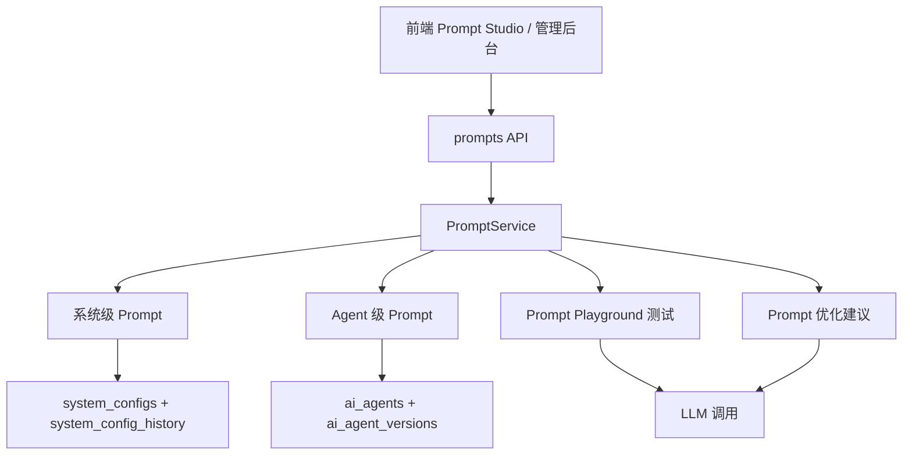
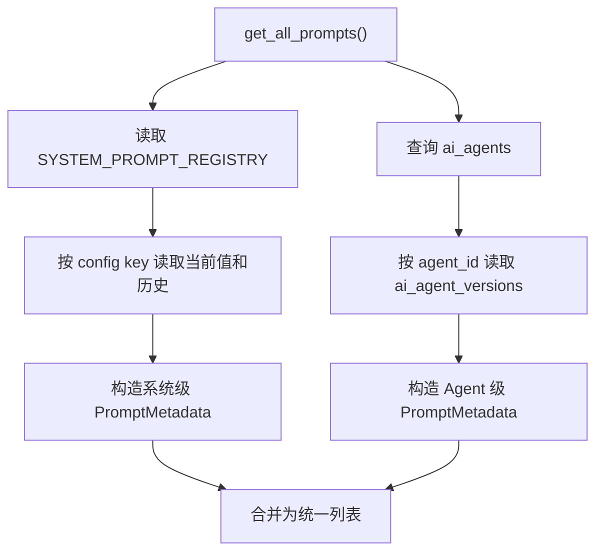
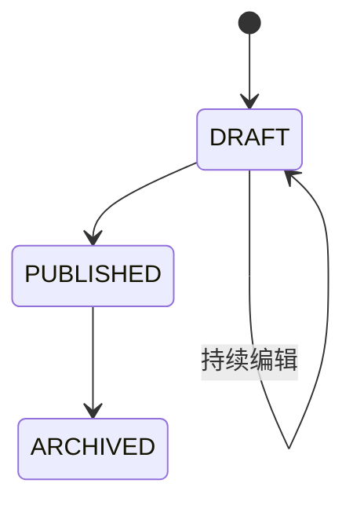
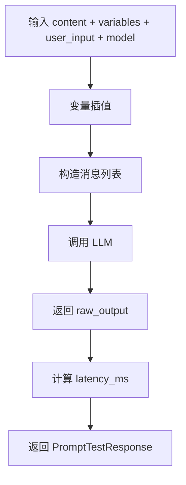
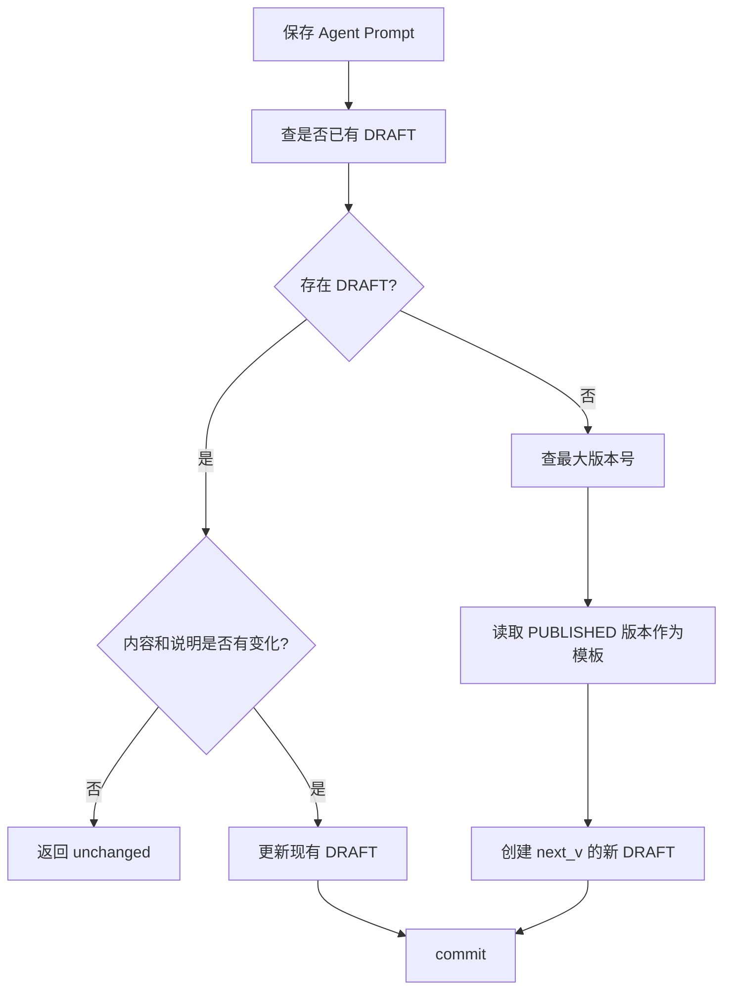

# 提示词相关服务核心逻辑详解

本文用于解释 [`prompt.py`](/Users/jacob/GitProject/ai-agent-platform/app/schemas/prompt.py) 和 [`prompt_service.py`](/Users/jacob/GitProject/ai-agent-platform/app/services/ai/prompt_ops/prompt_service.py) 为核心的提示词相关服务实现，重点面向教学、代码走读和系统设计说明。

为了把链路讲完整，本文也会补充几个直接相关的文件：

- [`prompts.py`](/Users/jacob/GitProject/ai-agent-platform/app/api/portal/endpoints/prompts.py)
- [`config_service.py`](/Users/jacob/GitProject/ai-agent-platform/app/services/config_service.py)
- [`agent.py`](/Users/jacob/GitProject/ai-agent-platform/app/models/agent.py)

这套实现本质上不是“单纯存一段 Prompt 文本”，而是一套：

- 提示词元数据建模
- 提示词版本管理
- 提示词测试与变量注入
- Prompt Playground 优化建议
- 系统级 Prompt 与 Agent 级 Prompt 的统一读写入口

## 1. 这个模块解决什么问题

在一个多智能体平台里，提示词不是一份静态字符串，而是一个需要长期维护的配置资产。

平台通常会遇到这些需求：

- 怎么统一列出所有可编辑 Prompt
- 怎么区分系统级 Prompt 和智能体级 Prompt
- 怎么查看历史版本
- 怎么在保存前先测试效果
- 怎么把修改沉淀成版本，而不是直接覆盖

`prompt.py + prompt_service.py` 这套逻辑，本质上就是平台的“提示词工程后台”。

## 2. 整体架构

这张图里最重要的一点是：

- 系统级 Prompt 和 Agent 级 Prompt 走的是两套不同的持久化模型
- 但在 `PromptService` 里被包装成统一的操作接口

## 3. 提示词的两种来源

这套系统首先把 Prompt 分成两类，定义在 [`prompt.py`](/Users/jacob/GitProject/ai-agent-platform/app/schemas/prompt.py) 的 `PromptSource` 里：

- `SYSTEM_CONFIG`
- `AGENT`

### 3.1 系统级 Prompt

系统级 Prompt 指的是：

- 以配置项形式存在于 `system_configs`
- 通过配置中心读取和保存
- 历史记录存放在 `system_config_history`

这种 Prompt 更像“平台级系统参数”。

### 3.2 Agent 级 Prompt

Agent 级 Prompt 指的是：

- 直接挂在某个智能体版本上
- 存在 `ai_agent_versions.system_prompt`
- 有显式的版本号和状态流转

这种 Prompt 更像“某个智能体的人设和行为定义”。

## 4. Schema 层：`prompt.py` 在做什么

`prompt.py` 不是业务逻辑，而是这套 Prompt Studio 的“数据契约层”。

它最重要的作用是把前后端之间的概念统一下来。

## 5. 列表视图模型：`PromptMetadata`

`PromptMetadata` 描述的是“Prompt 列表页上一行卡片需要展示什么”，包括：

- `id`
- `name`
- `display_name`
- `source`
- `category`
- `description`
- `target_key`
- `agent_id`
- `created_by`
- `is_system`
- `current_version`
- `versions`

它的意义在于：

- 把系统配置 Prompt 和 Agent Prompt 都投影成同一种列表项

也就是说，前端不需要分别理解两套底层表结构，只需要消费统一的 `PromptMetadata`。

## 6. 详情视图模型：`PromptDetail`

`PromptDetail` 是“打开一个 Prompt 详情页”时返回的结构，包括：

- `content`
- `version_number`
- `version_note`
- `variables`

其中 `variables` 很关键，它来自对 Prompt 文本中 `{variable}` 占位符的自动提取。

这让前端测试台可以自动知道有哪些变量可以注入。

## 7. 测试与保存模型

`prompt.py` 里还定义了几组典型操作模型：

- `PromptTestRequest`
- `PromptTestResponse`
- `PromptSaveRequest`
- `PromptOptimizeResponse`

这说明系统对 Prompt 的操作不是只有“读”和“写”，而是内建了：

- Playground 测试
- 版本说明保存
- AI 优化建议生成

## 8. `PromptService` 的核心职责

`PromptService` 可以理解为 Prompt Studio 的统一应用服务层。

它主要负责 6 件事：

1. 枚举所有 Prompt
2. 获取指定 Prompt 的详情
3. 测试 Prompt
4. 保存 Prompt
5. 优化 Prompt
6. 查询 Agent Prompt 历史

## 9. 变量提取：`extract_variables()`

这是最轻的一层逻辑，但很实用。

它通过正则：

- `\{([^{}]+)\}`

提取形如 `{dataset_name}`、`{user_input}` 的占位符。

返回的是去重后的变量名列表。

这个能力通常会被前端用来：

- 自动生成变量输入框
- 在测试台里提示哪些变量还没填

## 10. Prompt 总览：`get_all_prompts()`

这是 Prompt Studio 列表页最核心的方法。

它把两种不同来源的 Prompt 统一拉平为一个列表。

### 10.1 系统级 Prompt 是怎么列出来的

系统级 Prompt 不会自动扫描整个 `system_configs` 表，而是先看：

- `SYSTEM_PROMPT_REGISTRY`

也就是说，只有被注册进这个 registry 的配置项，才会被视为“可管理的系统 Prompt”。

这是一种白名单设计。

### 10.2 为什么现在 `SYSTEM_PROMPT_REGISTRY` 是空的

代码里明确说明：

- 路由 Prompt
- 意图识别 Prompt

已经内置在代码里，不再通过数据库配置管理，避免被运营误改。

因此当前这个 registry 为空，意味着：

- 现阶段 Prompt Studio 主要管理 Agent 级 Prompt
- 系统级 Prompt 管理能力是预留的，但默认不开太多入口

### 10.3 Agent 级 Prompt 是怎么列出来的

`get_all_prompts()` 会：

1. 查询 `ai_agents`
2. 再按 `agent_id` 查询 `ai_agent_versions`
3. 把版本号、状态、注释、创建时间转成 `PromptVersionSummary`

最终输出为统一的 `PromptMetadata`。

这使得前端可以在一个列表里同时看到：

- 这个 Prompt 属于哪个 Agent
- 有哪些版本
- 当前是系统 Agent 还是用户创建 Agent

## 11. 版本语义：系统级 Prompt 和 Agent Prompt 完全不同

这是整个模块最值得讲清楚的一点。

## 12. 系统级 Prompt 的版本是“推导出来的”

系统级 Prompt 真实存储方式是：

- 当前值在 `system_configs`
- 历史变更在 `system_config_history`

所以它没有一张“每个版本一行”的主版本表。

`PromptService` 的做法是：

- 当前值视为最新版本
- 历史表里的每条审计记录视为旧版本快照
- 用 `len(history) + 1` 推导当前版本号

这是一种“配置中心风格”的版本模型。

### 12.1 它的好处

- 复用配置系统，不必单独建表
- 自动带审计信息

### 12.2 它的特点

- 当前版本是“显式当前值”
- 历史版本是“通过 old_value 回溯”

## 13. Agent Prompt 的版本是“真实版本表”

Agent Prompt 则完全不同。

它的版本实体直接存在 `ai_agent_versions` 中，每一行都包含：

- `agent_id`
- `version_number`
- `model_name`
- `temperature`
- `system_prompt`
- `tools`
- `status`
- `comment`

状态值主要有：

- `DRAFT`
- `PUBLISHED`
- `ARCHIVED`

这是一种更标准的“版本化内容管理”设计。

## 14. 详情查看：`get_prompt_detail()`

这个方法负责把某一份 Prompt 的内容真正取出来。

它的核心难点在于：

- 系统级 Prompt 的版本需要从配置历史“映射”
- Agent Prompt 的版本可以直接按版本号查表

## 15. 系统级详情是怎么取的

系统级逻辑大致是：

1. 查 `ConfigService.get_config_history(target_id)`
2. 计算 `total_versions = len(history) + 1`
3. 如果请求的是最新版本，就读 `ConfigService.get(target_id)`
4. 如果请求的是旧版本，就从历史列表里反推出对应的 `old_value`

这里的版本语义是：

- 最新版本来自当前配置值
- 历史版本来自某次变更前的旧值

## 16. Agent 详情是怎么取的

Agent 级逻辑更直接：

- 指定了 `version` 就按 `agent_id + version_number` 查
- 没指定就优先查 `status = 'PUBLISHED'`
- 如果没有发布版，则尝试回退到最新版本

然后把 `system_prompt`、版本号、注释以及提取出的变量名一起返回。

## 17. Prompt 测试：`test_prompt()`

这是 Prompt Playground 的核心能力。

它解决的是：

- 我改了 Prompt，但不想马上保存
- 我想先把变量灌进去，看看模型怎么回答

### 17.1 测试流程

### 17.2 变量插值很朴素

当前实现不是模板引擎，而是简单的字符串替换：

- 把 `{k}` 替换成 `variables[k]`

这意味着它适合做 Prompt Playground，但不具备复杂模板语法能力。

### 17.3 为什么支持 `user_input`

如果只传 Prompt 内容，系统可以把它当成单条消息测试。

如果再传一个 `user_input`，就能模拟：

- `system prompt + user message`

这种更接近真实 Agent 对话的调用场景。

### 17.4 为什么连模型名也允许传入

因为 Prompt 效果常常依赖模型。

所以这里允许临时指定：

- `model`

方便在 Prompt Studio 里直接比较不同模型下的行为差异。

## 18. Prompt 保存：`save_prompts()`

这个方法是整套系统里最核心的“写入逻辑”。

但要特别注意：

- 系统级 Prompt 和 Agent 级 Prompt 的保存策略完全不同

## 19. 系统级保存：直接走配置中心

如果 `source == SYSTEM_CONFIG`，它会调用：

- `ConfigService.set_config(...)`

这里会自动完成：

- 当前值写入 `system_configs`
- 审计记录写入 `system_config_history`
- Redis 缓存刷新

所以系统级 Prompt 的保存，本质上是一次“带审计的配置项更新”。

## 20. Agent 保存：不是直接覆盖，而是维护 Draft

如果 `source == AGENT`，逻辑就精细很多。

### 20.1 优先更新已有 Draft

系统先查：

- 当前 Agent 是否已有 `status = 'DRAFT'` 的版本

如果有：

- 内容和注释都没变，则返回 `False`
- 否则更新这条 Draft 记录

这表示：

- Draft 是“可反复编辑的工作区”
- 不是每次点保存都新建一个版本

### 20.2 没有 Draft 才创建新 Draft

如果当前没有 Draft：

1. 查询该 Agent 现有最大版本号
2. `next_v = max + 1`
3. 取当前已发布版本的模型配置作为模板
4. 插入一条新的 `DRAFT`

模板继承的内容包括：

- `model_name`
- `tools`
- `synthesis_model_name`
- `synthesis_temperature`

这说明在 Agent Prompt 编辑器里，用户改的主要是：

- `system_prompt`
- `comment`

而不是每次都重新配置整套模型参数和工具列表。

## 21. 这说明系统当前更像“编辑器”，不是完整发布台

从 `prompt_service.py` 能看出来：

- 它负责编辑
- 负责生成 Draft
- 负责查看历史

但它本身不负责“把 Draft 发布成 Published”。

也就是说，这份服务当前覆盖的是：

- Prompt 编写和实验阶段

而不是完整的发布审批流。

## 22. Prompt 优化：`optimize_prompt()`

这是一个典型的“AI 帮你写 Prompt”的能力。

它会要求 LLM 基于原始 Prompt，生成 5 种不同优化方向的版本，建议维度包括：

- 结构化增强
- Few-shot
- 角色设定
- 思维链
- 清晰约束

返回结构是：

- `suggestions[]`
  - `title`
  - `content`
  - `reason`

所以它不是直接替你改掉原 Prompt，而是产出一组“候选优化方案”供人工选择。

## 23. Agent Prompt 历史：`get_agent_prompt_history()`

系统级 Prompt 的历史来自配置审计表。

Agent Prompt 的历史则来自：

- `ai_agent_versions`

这个方法会把版本表重新格式化成类似审计日志的形状，包含：

- `change_type`
- `changed_by`
- `created_at`
- `description`
- `new_value`
- `old_value`

其中 `old_value` 是通过“当前版本的下一条记录”来近似当作上一个版本内容。

这让前端历史页不需要分别理解两套历史表结构。

## 24. API 层：`prompts.py`

`prompts.py` 是这套 Prompt Studio 的接口入口。

主要接口包括：

- `GET /`：列出所有 Prompt
- `GET /detail`：查看某个 Prompt 详情
- `POST /test`：测试 Prompt
- `POST /save`：保存 Prompt
- `POST /optimize`：获取 AI 优化建议
- `GET /history`：查看变更历史

## 25. 这个 API 层体现了什么权限设计

接口层可以看到：

- 普通查看接口需要当前用户身份
- 保存需要 `element:prompts:edit`
- 优化需要 `element:prompts:optimize`

这说明 Prompt Studio 在平台里被当成一个需要细粒度授权的“后台能力”，而不是所有人都能改的普通配置页。

## 26. `ConfigService` 在这套设计中的作用

如果只看 `prompt_service.py`，容易误以为系统级 Prompt 也是普通版本表。

但实际上系统级 Prompt 完全依赖 `ConfigService` 提供：

- `get`
- `set_config`
- `update_config_value`
- `get_config_history`

### 26.1 为什么这很重要

这意味着系统级 Prompt 不是一类特殊内容对象，而是配置中心中的一种配置项。

因此它天然获得了：

- Redis 缓存
- 审计历史
- 分类管理
- 批量更新能力

## 27. `AIAgentVersion` 在这套设计中的作用

`AIAgentVersion` 是 Agent Prompt 的真正载体。

它不仅存 Prompt 文本，还存：

- 模型名
- 温度
- 工具列表
- 合成模型配置
- 状态
- 版本号
- 注释

这说明“Prompt 版本”在智能体维度上，其实是“Agent 运行配置版本”的一部分，而不是孤立文本版本。

## 28. 教学上最值得强调的设计点

## 29. 统一接口，分离底层存储

最值得学习的一点是：

- 前台统一叫“Prompt”
- 后台其实有两套完全不同的存储和版本模型

`PromptService` 的价值就在于把这两套实现隐藏掉。

## 30. Agent Prompt 采用 Draft 工作流

这比“直接覆盖已发布版本”稳很多。

它允许：

- 反复试验
- 反复测试
- 保存为草稿

再由其他机制决定是否发布。

## 31. 系统级 Prompt 更像配置项，而不是内容对象

这是一种很务实的设计：

- 平台级 Prompt 通常数量少
- 更需要审计和缓存
- 不一定需要复杂 Draft/Publish 流程

因此直接复用配置系统，比额外造一套 Prompt 版本系统更轻。

## 32. 测试、保存、优化形成了 Prompt 工程闭环

这套服务不是只支持“编辑一段文本”。

它完整覆盖了：

1. 看现状
2. 看历史
3. 抽变量
4. 先测试
5. 再保存
6. 需要时让 AI 给出优化建议

这就是一个比较完整的 Prompt 工程工作台。

## 33. 当前实现中的注意点

下面这些点不影响我们理解整体设计，但如果用来教学，最好同时说明“理想设计”和“当前代码现状”。

## 34. `SYSTEM_PROMPT_REGISTRY` 当前为空

这意味着系统级 Prompt 列表在现状下可能为空，至少不会自动展示所有系统配置项。

这是有意收口，不是漏功能。

因为像路由和意图识别 Prompt 已经被改成代码内置，不允许在后台随便改。

## 35. `get_prompt_detail()` 的 Agent 回退逻辑有实现风险

当前代码里对于“没有 Published 时回退最新版本”的判断依赖：

- `result.rowcount`

但很多数据库驱动对 `SELECT` 的 `rowcount` 并不可靠，可能为 `-1`。

这意味着“没有发布版时自动回退到最新版本”的行为，在实际运行中可能不稳定。

## 36. `test_prompt()` 的消息构造存在可疑写法

在 `user_input` 存在时，代码使用了：

- `RuntimeMessage(type="text", text=...)`

作为 `content` 元素。

而同文件其他地方和常规写法更像是应该使用：

- `RuntimeContentBlock(type="text", text=...)`

这说明测试台在某些场景下可能存在消息结构兼容性问题。

## 37. 系统级版本号是推导值，不是强一致版本主键

这意味着：

- 它适合展示和回溯
- 但不如独立版本表那样天然严格

教学时最好把“系统配置历史”与“内容版本表”这两种模式明确区分。

## 38. `get_agent_prompt_history()` 里 `changed_by` 目前写死为 `System`

这说明 Agent Prompt 版本表当前没有真正记录“是谁改的”。

所以历史页虽然长得像审计日志，但在操作者追踪上还不完整。

## 39. `optimize_prompt()` 只做 JSON 解析，没有更强容错

相比别的一些服务里会做代码块剥离再正则抽 JSON，这里虽然也清理了 markdown fence，但整体容错仍偏轻。

如果模型多输出解释文本，可能会直接失败。

## 40. 一句话总结

这套提示词相关服务的核心，不是“把 Prompt 存到数据库”，而是：

**把 Prompt 当成一种可枚举、可测试、可版本化、可优化、可审计的工程资产来管理，并在统一入口下同时兼容系统配置型 Prompt 和智能体版本型 Prompt。**

如果用更工程化的话概括，它是一个：

**以 `PromptService` 为统一编排层、以 `system_configs` 和 `ai_agent_versions` 为双后端存储的 Prompt Studio 后台能力。**
