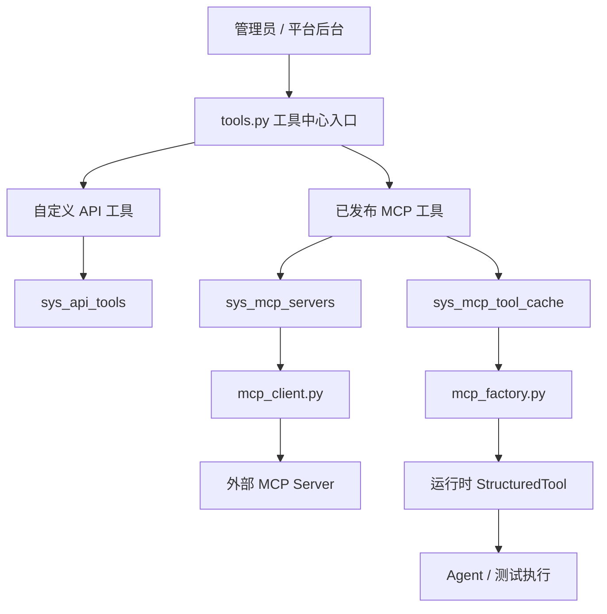
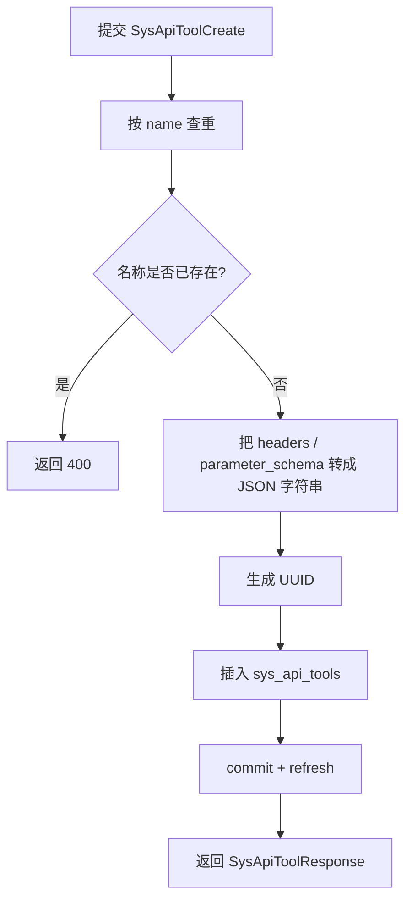
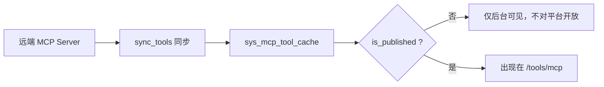
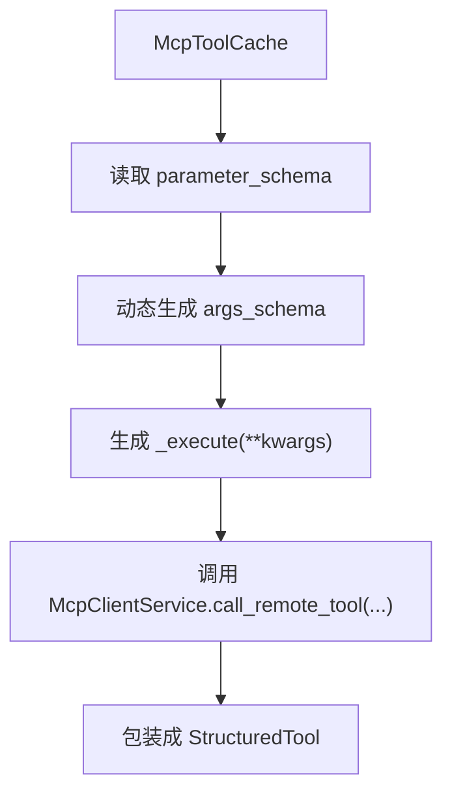

# 工具相关服务核心逻辑详解

本文用于解释 [`tools.py`](/Users/jacob/GitProject/ai-agent-platform/app/api/portal/endpoints/tools.py) 为核心的工具相关服务实现，重点面向教学、代码走读和系统设计说明。

为了把整条链路讲完整，本文也会补充几个直接相关的文件：

- [`tool.py`](/Users/jacob/GitProject/ai-agent-platform/app/models/tool.py)
- [`tool.py`](/Users/jacob/GitProject/ai-agent-platform/app/schemas/tool.py)
- [`mcp.py`](/Users/jacob/GitProject/ai-agent-platform/app/models/mcp.py)
- [`mcp.py`](/Users/jacob/GitProject/ai-agent-platform/app/api/portal/endpoints/mcp.py)
- [`mcp_client.py`](/Users/jacob/GitProject/ai-agent-platform/app/services/ai/tools/mcp_client.py)
- [`mcp_factory.py`](/Users/jacob/GitProject/ai-agent-platform/app/services/ai/tools/mcp_factory.py)

这套实现本质上管理的是两类“工具”：

- 平台内自定义的 API 工具
- 从外部 MCP Server 发现、缓存并发布出来的 MCP 工具

因此，`tools.py` 虽然文件不大，但它其实是“工具中心”的统一入口，而不是全部逻辑都写在一个文件里。

## 1. 这个模块解决什么问题

在智能体平台里，“工具”不是单一来源：

- 有些工具是平台管理员自己录入的 HTTP API 工具
- 有些工具来自外部 MCP Server，需要先同步、缓存、审核发布

系统需要解决的问题包括：

- 如何列出当前平台有哪些工具
- 如何让管理员创建和修改自定义 API 工具
- 如何把 MCP 工具从远端同步到本地
- 如何决定哪些 MCP 工具对平台可见
- 如何把缓存的 MCP 工具封装成运行时可调用对象

所以这里的核心不是“CRUD 一张表”，而是“工具资产管理 + MCP 工具接入”。

## 2. 整体架构

这张图里最关键的一点是：

- `tools.py` 负责“聚合展示和基础管理”
- MCP 工具真正的发现、同步、执行，不是在 `tools.py` 里完成，而是在 MCP 相关服务中完成

## 3. 两类工具的边界

## 4. 第一类：自定义 API 工具

自定义 API 工具存储在：

- `sys_api_tools`

它们的特点是：

- 由平台管理员手工创建
- 本质上描述一段 HTTP 调用模板
- 包含方法、URL、Header、参数 Schema 等信息

这类工具更像“平台内部维护的 API 封装注册表”。

## 5. 第二类：MCP 工具

MCP 工具来自：

- 远端 MCP Server

平台会把它们同步到本地缓存表：

- `sys_mcp_tool_cache`

但缓存到本地不代表立即可用，还要经过：

- 是否发布 `is_published`

这类工具更像“远端能力镜像 + 本地发布控制”。

## 6. `tools.py` 的定位

如果只看 `tools.py`，会发现它只提供了 5 个接口：

- `GET /tools/mcp`
- `GET /tools`
- `POST /tools`
- `PUT /tools/{tool_id}`
- `DELETE /tools/{tool_id}`

这说明它的设计定位很明确：

- 给工具中心页面提供基础列表与 CRUD 能力
- 尤其负责“自定义 API 工具”的管理
- 同时补一个“已发布 MCP 工具”的统一读取入口

它不是 MCP Server 管理后台，也不是工具执行器本身。

## 7. 数据模型：自定义 API 工具 `SysApiTool`

[`tool.py`](/Users/jacob/GitProject/ai-agent-platform/app/models/tool.py) 中的 `SysApiTool` 定义了自定义 API 工具的最小结构：

- `id`
- `name`
- `description`
- `method`
- `url_template`
- `headers`
- `parameter_schema`
- `is_active`

其中有两个字段特别重要：

- `headers`
- `parameter_schema`

虽然它们在业务上是结构化对象，但数据库里是以 `Text` 字段保存的 JSON 字符串。

这意味着：

- 写库前需要 `json.dumps`
- 读出来给前端前需要 `json.loads`

## 8. Schema 层：`SysApiToolCreate / Update / Response`

[`app/schemas/tool.py`](/Users/jacob/GitProject/ai-agent-platform/app/schemas/tool.py) 把接口输入输出契约统一下来。

### 8.1 创建和返回结构

基础字段定义在 `SysApiToolBase`：

- `name`
- `description`
- `method`
- `url_template`
- `headers`
- `parameter_schema`
- `is_active`

这里前端看到的 `headers` 和 `parameter_schema` 是正常字典，而不是原始 JSON 字符串。

### 8.2 为什么 `SysApiToolResponse` 要做 `field_validator`

返回模型里有：

- `@field_validator('headers', 'parameter_schema', mode='before')`

它的作用是：

- 如果数据库里拿到的是字符串，就自动 `json.loads`
- 如果解析失败，就返回空对象

也就是说，Schema 层主动承担了“把数据库存储格式还原为接口友好格式”的责任。

## 9. `GET /tools`：列出所有自定义 API 工具

`list_tools()` 是最简单的一条链路：

- 查询 `SysApiTool`
- 按 `created_at desc` 排序
- 直接返回 ORM 对象列表

之所以这能工作，是因为 `SysApiToolResponse` 已经负责把：

- `headers`
- `parameter_schema`

从字符串转回字典。

所以这个接口虽然实现简短，但依赖了 Schema 层的格式修正能力。

## 10. `POST /tools`：创建自定义 API 工具

这个接口是自定义 API 工具的主入口。

执行流程大致如下：

### 10.1 为什么要先按 `name` 查重

因为工具名在系统里承担的是“逻辑唯一标识”的角色。

如果同名工具存在，会导致：

- Agent 配置里引用不稳定
- 前端列表难以区分
- 后续执行和授权容易混乱

所以创建前必须保证 `name` 唯一。

### 10.2 为什么写库前要序列化 JSON

因为 `SysApiTool.headers` 和 `parameter_schema` 在数据库里是 `Text` 字段。

所以创建时会显式执行：

- `json.dumps(data["headers"])`
- `json.dumps(data["parameter_schema"])`

这属于典型的“接口层收结构化对象，存储层落文本”的桥接逻辑。

## 11. `PUT /tools/{tool_id}`：更新自定义 API 工具

更新逻辑与创建相似，但支持部分字段 patch。

核心流程是：

1. 按 `tool_id` 查工具
2. 如果不存在返回 404
3. 用 `exclude_unset=True` 只拿本次提交的字段
4. 对 `headers` / `parameter_schema` 做 JSON 序列化
5. 逐字段 `setattr`
6. `commit + refresh`

### 11.1 为什么这里使用 `exclude_unset=True`

因为更新接口希望支持“只改一部分字段”。

比如只修改：

- `description`
- `is_active`

而不是要求每次把整个工具定义完整重传。

## 12. `DELETE /tools/{tool_id}`：删除自定义 API 工具

删除逻辑也很直接：

- 先查
- 不存在则 404
- 存在则删除
- 提交事务

从这点也能看出，自定义 API 工具当前没有额外的版本管理或软删除机制，属于比较直接的后台配置对象。

## 13. `GET /tools/mcp`：列出已发布的 MCP 工具

这是 `tools.py` 里最有平台聚合意味的接口。

它做的不是列出所有 MCP 工具，而是只列出：

- `McpToolCache.is_published == True`

并且通过 `joinedload(McpToolCache.server)` 一次性把归属服务器也带出来。

返回字段包括：

- `id`
- `name`
- `description`
- `server_name`
- `parameter_schema`

这说明工具中心对 MCP 工具的视角是：

- 只关心“哪些工具已对平台开放”
- 不关心 MCP Server 下还有多少未发布工具

## 14. MCP 工具为什么要有“缓存”和“发布”两层

这个设计非常关键。

如果 MCP 工具直接从远端即插即用，会有几个问题：

- 远端工具集合可能变化频繁
- 平台管理员无法做上线筛选
- Agent 可能突然看到不该暴露的新工具

因此系统把 MCP 工具分成两层：

1. **发现/缓存层**
   - 通过 `sync_tools()` 把远端工具同步到本地 `sys_mcp_tool_cache`

2. **发布层**
   - 通过 `is_published` 决定它是否真正进入平台工具可见范围

## 15. MCP 相关数据模型

[`app/models/mcp.py`](/Users/jacob/GitProject/ai-agent-platform/app/models/mcp.py) 里有两个核心表：

- `McpServer`
- `McpToolCache`

### 15.1 `McpServer`

保存的是 MCP Server 连接信息：

- `server_name`
- `sse_url`
- `auth_headers`
- `enabled_status`
- `last_sync_at`

### 15.2 `McpToolCache`

保存的是从远端发现的工具快照：

- `server_id`
- `tool_name`
- `tool_description`
- `parameter_schema`
- `is_published`

因此：

- `McpServer` 描述“工具源”
- `McpToolCache` 描述“从该源拉回来的工具清单”

## 16. MCP Server 管理和 `tools.py` 的关系

真正的 MCP Server 管理接口不在 `tools.py`，而在：

- [`app/api/portal/endpoints/mcp.py`](/Users/jacob/GitProject/ai-agent-platform/app/api/portal/endpoints/mcp.py)

这里负责：

- 验证连接
- 创建/更新/删除 MCP Server
- 手动同步工具
- 查看某个 Server 的工具
- 执行工具
- 发布或下线工具

因此可以把职责理解为：

- `mcp.py` 管 MCP 接入过程
- `tools.py` 管工具中心视角下的“已发布结果”

## 17. MCP 工具发现：`McpClientService.sync_tool(s)` 在做什么

在 [`mcp_client.py`](/Users/jacob/GitProject/ai-agent-platform/app/services/ai/tools/mcp_client.py) 中，`sync_tool()` / `sync_tools()` 的作用是：

- 连上远端 MCP Server
- 调用 `list_remote_tools()`
- 把远端工具清单写入本地 `McpToolCache`

写入时会把工具名拼成：

- `server_name:tool_name`

这样可以避免不同 MCP Server 上同名工具冲突。

### 17.1 为什么要把远端工具名改成 `server:tool`

因为平台里可能接多个 MCP Server，例如：

- `weather:get_current`
- `crm:get_current`

如果只保留 `get_current`，名字会撞车。

加上 `server_name` 前缀后，工具命名才在平台范围内稳定唯一。

## 18. MCP 连接：SSE 优先，失败后回退 Direct HTTP

`McpSseSession.connect()` 体现了 MCP 接入层的一个重要设计：

- 优先尝试标准 SSE 模式
- 如果失败，则回退到直连 HTTP RPC 模式

这说明系统对接外部 MCP Server 时，考虑了现实世界里协议实现不完全一致的问题。

### 18.1 为什么这对平台很重要

因为如果平台只支持一种严格接入方式，很多第三方 MCP 服务会接不上。

而当前这套设计提供了：

- 标准路径
- 兼容降级路径

因此容错性更高。

## 19. MCP 工具执行：`McpToolFactory.create_tool()`

从平台视角看，缓存里的一条 `McpToolCache` 记录还不能直接执行。

需要先通过 [`mcp_factory.py`](/Users/jacob/GitProject/ai-agent-platform/app/services/ai/tools/mcp_factory.py) 转成运行时工具对象。

这个过程做了两件关键事情：

1. 从 `parameter_schema` 动态构造 Pydantic 参数模型
2. 生成一个异步执行函数 `_execute(**kwargs)`

然后再包装成：

- `StructuredTool`

这意味着 MCP 工具在运行时会被变成和平台其他工具统一的“可调用工具对象”。

## 20. 为什么参数 Schema 这么重要

MCP 工具不是一段任意函数代码，而是远端工具定义 + JSON Schema。

平台本地必须依赖这个 Schema 来知道：

- 有哪些参数
- 哪些是必填
- 参数类型是什么
- 每个参数的描述是什么

`McpToolFactory` 正是在做“从 JSON Schema 到本地调用签名”的桥接。

## 21. MCP 工具执行测试：`/mcp/tools/{tool_id}/execute`

虽然用户这次指定的核心文件是 `tools.py`，但要讲“工具服务的完整逻辑”，这个执行接口值得补充。

在 [`mcp.py`](/Users/jacob/GitProject/ai-agent-platform/app/api/portal/endpoints/mcp.py) 里：

- 先按 `tool_id` 查 `McpToolCache`
- 再调用 `McpToolFactory.create_tool(tool)`
- 然后执行 `await lc_tool.ainvoke(req.arguments)`

这说明 MCP 工具管理后台不仅能同步和发布，还能直接做一次执行验证。

## 22. MCP 工具发布：`is_published`

MCP 工具最终能不能进入 `GET /tools/mcp`，取决于：

- `is_published`

发布接口在：

- `PUT /mcp/tools/{tool_id}/publish`

只是简单更新一个布尔值，但它背后的业务含义非常重要：

- 缓存到本地 ≠ 对平台开放
- 只有管理员显式发布，才算正式进入工具中心

## 23. 平台怎么知道 MCP 工具有没有被 Agent 用到

在 `list_mcp_server_tools()` 里，系统会扫描：

- `ai_agent_versions.tools`

统计每个 MCP 工具在多少个 Agent 版本配置中被引用过，形成：

- `usage_count`

这说明平台不仅想展示“有哪些工具”，还想展示“这些工具有没有真正被 Agent 使用”。

这是很典型的工具治理视角。

## 24. 权限模型

从 `tools.py` 和 `mcp.py` 可以看到，工具相关能力有明显权限分层：

- 查看工具列表通常需要
  - `require_permission("menu", "menu:system:config")`

- 创建、编辑、删除、发布、执行通常需要
  - `require_permission("element", "element:system:config_save")`

这说明工具中心被当成系统配置后台的一部分，而不是普通业务用户功能。

## 25. `tools.py` 这份文件真正体现的设计思想

如果抽象一下，`tools.py` 做的其实是“统一暴露平台可管理工具资产”：

- 自定义 API 工具：平台内部定义
- 已发布 MCP 工具：外部能力接入后的平台投影

也就是说，它管理的是“平台认可并可供后续使用的工具”，而不是所有原始来源。

## 26. 这套设计最值得学习的点

## 27. 把“接入”和“发布”分开

这是整套工具体系最值得讲的一点。

MCP 工具先同步到缓存，再由管理员决定是否发布。

这样做有几个好处：

- 外部工具不会自动污染平台工具空间
- 管理员能控制上线节奏
- 平台能做工具筛选和治理

## 28. 用本地缓存隔离外部不稳定性

远端 MCP Server 可能：

- 临时不可用
- 工具定义变化
- 权限或认证变化

本地 `McpToolCache` 让平台在管理层有一个稳定视图，而不是每次打开后台都实时依赖外部服务。

## 29. 运行时通过 Schema 动态生成工具签名

`McpToolFactory` 的设计很典型：

- 远端提供 JSON Schema
- 本地动态生成 Pydantic 参数模型
- 再包装成统一的 Tool 抽象

这是把“外部协议定义”转成“平台内部执行模型”的关键桥梁。

## 30. 自定义 API 工具和 MCP 工具复用同一工具中心概念

虽然底层来源不同，但在管理后台里它们都被视为“工具资产”。

这说明产品层面对工具的抽象做得比较统一。

## 31. 当前实现中的注意点

下面这些点不影响我们理解整体设计，但如果用于教学，最好同时说明“理想设计”和“当前代码现状”。

## 32. `GET /tools/mcp` 当前返回的是集合推导，不是列表

代码当前写的是：

- `return { {...} for t in tools }`

这在 Python 里会构造集合推导，而集合里的元素又是字典，这是不可哈希的。

因此这段实现从语义上看有明显问题，正确意图应该更像是返回列表。

## 33. `tools.py` 里导入了未使用的内容

例如：

- `require_admin`
- `tools` from `agentscope`

这些当前没有实际参与逻辑，说明文件里存在一些遗留导入。

## 34. 自定义 API 工具当前只有存储和展示，未看到统一执行链路

从当前代码范围看，`SysApiTool` 具备：

- URL 模板
- Header
- 参数 Schema

但 `tools.py` 并没有提供对应的执行接口。

这说明当前“自定义 API 工具”更偏配置注册表，而不是完整闭环的运行时工具系统。

## 35. `mcp.py` 和 `mcp_client.py` 里存在若干命名瑕疵

例如从代码可见：

- `sync_tool()` / `sync_tools()` 混用
- `too_name` / `tool_name` 变量不一致
- `sse_err` 被记录但前面异常变量名是 `e`

这些问题不改变整体架构思路，但会影响某些路径的运行稳定性。

## 36. MCP 工具缓存同步当前没有显式清理“远端已删除但本地仍保留”的工具

当前 `sync_tool()` 主要是：

- 更新已有记录
- 新增新工具

但没有明显看到删除远端已不存在工具的逻辑。

因此随着外部工具变化，本地缓存理论上可能出现陈旧项，需要后续治理策略补齐。

## 37. `tools.py` 更像“后台工具资产管理”，不是最终运行时总线

这点教学时最好讲清楚：

- `tools.py` 管的是后台视图和数据入口
- 真正的 MCP 运行时执行在 `mcp_factory.py + mcp_client.py`
- 自定义 API 工具的执行闭环当前还不完整

## 38. 一句话总结

这套工具相关服务的核心，不是“提供几个增删改查接口”，而是：

**把平台内部自定义 API 工具和外部 MCP 工具统一纳入一套后台管理模型中，通过本地缓存、发布控制、Schema 驱动封装和运行时桥接，逐步形成平台可控的工具资产层。**

如果用更工程化的话概括，它是一个：

**以 `tools.py` 为工具中心入口、以 `sys_api_tools` 和 `sys_mcp_tool_cache` 为双来源存储、以 MCP 客户端与工厂模式为运行时桥接的工具治理体系。**
